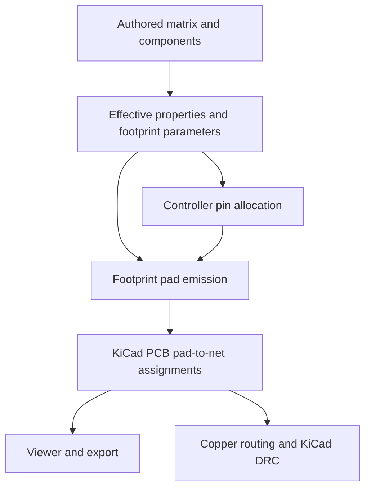

# PCB creation: missing pads and disconnected KiCad nets

Research date: 20 September 2026. Scope: current working tree at `347229abc1561a44a2dc6cc0cee50969b49b267e`, including existing uncommitted changes. Product code was not changed. Runtime: Node 24.14.0. Findings below distinguish emitted pad assignments from physical copper routing.

Evidence:30 cited source entries (26 primary;5 external domains). Research:15 axis workers,15 independent refiners,1 browser executor and2 final visual reviewers;3 research waves;4 bounded excursions;4 retained execution batches. Claim annex:3 refuted,2 unresolved. Elapsed at report assembly:24 minutes. Final counters: [RUN.json](RUN.json).

## Executive diagnosis

**There are real connectivity defects, concentrated in the paths that create or edit electronics.** The clearest reproduction adds a matrix to a native document without saved setup metadata, then inserts a Pro Micro. Switches and diodes acquire matrix nets during engine resolution, but controller allocation reads only explicit source properties. The exported MCU consequently has none of the matrix row/column nets. A comparable design generated by the setup wizard assigns those nets correctly. This is a mismatch between two electrical representations, not a failure to print net names into KiCad. [Source 1] [Source 2] [Source 3] [Source 4] [Source 5]

Two further failures directly match the reported symptoms: enabling a particular diode pad option emits a diode with **zero pads**, and disabling/re-enabling a diode after customizing its local switch connection recreates the diode on a different net without a wiring finding. Ordinary setup generation, by contrast, correctly connects switch/diode nets and LED chain names in the tested cases. [Source 1] [Source 6] [Source 7] [Source 8]

**Priority:** unify effective electrical-net resolution across matrix creation, assembly editing and controller assignment; then validate the emitted pad-to-net graph before export. Correcting geometry alone will not resolve these disconnected circuits. This is a proposed remedy, not an implemented fix. [Source 1] [Source 3] [Source 5]

## What “working nets” must mean

For the default diode orientation, the intended logical chain is:

```text
MCU column GPIO ── column net ── switch pad 1
                                  switch pad 2
                                       │ per-key local net
                                  diode pad 2 (anode)
                                  diode pad 1 (cathode)
                                       │ row net
                                  MCU row GPIO
```

The switch closes the connection between its two pads. The diode direction matches COL2ROW. LED wiring separately needs controller data → first DIN, each DOUT → next DIN, plus VCC/GND. An unused final LED DOUT is not itself a defect. Equal net names express intended connections; tracks/vias/appropriate copper must still realize them. [Source 6] [Source 8] [Source 9] [Source 10]



The broken boundary is often between effective footprint parameters and the source properties used by controller allocation. The current viewer is not a substitute for checking that boundary. [Source 3] [Source 5] [Source 11]

## Verified findings, ordered by repair priority

| Priority | Finding | Reproduction and consequence |
| --- | --- | --- |
| P0 | Setup-less matrix nets never reach MCU allocation | Matrix pads use `fingers_c1`, `fingers_c2`, `fingers_r1`; MCU GPIO pads retain `P0`, `P1`, `P2`… None of the three matrix nets appears on the controller. |
| P0 | Custom diode connection breaks when toggled off/on | Switch pad 2 remains `CUSTOM`; recreated diode pad 2 becomes `fingers_c1_r1_switch`. No electrical finding. |
| P1 | Diode option combination suppresses all pads | `include_thru_hole_smd_pads:true`, `reversible:false`, `include_tht:false` produces zero pads. |
| P1 | Assembly preservation ignores inherited switch wiring | Effective switch pad 1 changes `INHERITED_COL` → `C1` after applying an assembly with preservation requested. |
| P1 | Missing net-template metadata becomes an empty net | `from: '{{missing}}'` exports an empty-net pad; no missing-net-template diagnostic. |
| P1 | Electrical completeness is not validated | Authored switch nets can disagree with MCU assignments; property edits can allocate new MCU names without moving actual key pads. |
| P2 | Imported blank-number copper pads escape remapping | Original numeric net remains in the converted footprint; final KiCad10 normalization rejects unresolved/conflicting identifiers in tested cases. |

All entries have executed evidence and source anchors below. These priorities are engineering recommendations, not measured severity scores. [Source 1] [Source 3] [Source 5] [Source 7] [Source 12] [Source 13] [Source 14]

### 1. Matrix creation and controller insertion use different sources of truth

`syncControllerNets` collects `properties.column_net` and `properties.row_net` from raw authored objects. The native layout resolver can generate these values later even when the source contains no explicit properties. Setup-less matrix creation uses that latter route. Controller insertion clears template GPIO assignments, then runs the property-only allocator. [Source 2] [Source 3] [Source 4] [Source 5]

**MEASURED: two-column, one-row reproduction.**

| Net role | Setup-less matrix export | Present on MCU? | Wizard contrast |
| --- | --- | --- | --- |
| Column 1 | `fingers_c1` | No | `C1`, Pro Micro pad 14 |
| Column 2 | `fingers_c2` | No | `C2`, Pro Micro pad 13 |
| Row 1 | `fingers_r1` | No | `R1`, Pro Micro pad 17 |

Evidence: `plain-matrix` and `baseline` records in [verify-core.jsonl](verify-core.jsonl), with generated [plain-matrix.kicad_pcb](plain-matrix.kicad_pcb) and [baseline.kicad_pcb](baseline.kicad_pcb). [Source 1]

`createMatrix` is a reproduction utility, not the direct UI handler. The actual New Item matrix handler calls `addCluster`; resizing calls `resizeCluster`, and filling a cell calls `addCell`. They reach setup-less defaults when no saved setup exists. The same research script also exercises `addCluster` followed by controller insertion as `ui-add-cluster`: with a sufficiently large explicit board, it reproduces the disconnected MCU with both layout and electrical findings empty. This is executed application logic, not a claim that the complete user interaction was clicked in a browser. [Source 1] [Source 2] [Source 15]

The initial utility fixture also reports a **physical** MCU pad-outside-board finding. That finding does not diagnose the disconnected matrix. Do not describe that fixture as having no findings, or assume it passes every UI download gate. [Source 1]

**Repair:** resolve effective inherited/template-based electrical identities once, and make controller allocation consume them. Merely falling back to editor `keyNets()` is unsafe: its standard `fingers` fallback uses `C1/R1`, while native implicit nets use `fingers_c1/fingers_r1`. Both consumers must agree. [Source 3] [Source 5]

### 2. Electrical preservation is incomplete

Three distinct cases were executed through actual PCB generation:

- A manual switch `from: AUTH_COL` survives assembly editing while MCU pad 14 remains `C1`. The mismatch already exists before that edit; preservation is intentional, but the absence of a connectivity diagnostic is a gap.
- Renaming key properties to `AUTH_COL/AUTH_ROW` leaves switch/diode pads on `C1/R1`, while controller synchronization adds GPIOs on the new names.
- Moving the switch binding into its inherited part changes the effective pad net from `INHERITED_COL` to `C1` after applying an assembly with `preserve`. The original part remains, but its wiring stops being effective. [Source 1] [Source 3] [Source 12]

The diode toggle is more directly destructive: start with switch `to` and diode `from` both `CUSTOM`; disable and re-enable the diode. Switch pad 2 stays `CUSTOM`; the recreated diode pad 2 uses the generated local name. The retained reproduction executes preservation. Source inspection indicates replacement follows the same electrical preservation and recreation branches. The before/off stages are harness inputs; the retained PCB inventory records the re-enabled result. [Source 1] [Source 6] [Source 12]

**Repair:** define the switch-to-diode junction as one connection with two endpoints. Resolve inherited bindings before preservation. Preserve explicit user wiring, but surface conflicts instead of silently allocating incompatible GPIOs or recreating only one endpoint. [Source 1] [Source 12]

### 3. The padless diode is a concrete option bug

The emitter suppresses front and back SMD pads whenever `include_thru_hole_smd_pads` is enabled. Replacement pads require `reversible`; ordinary through-hole pads separately require `include_tht`. With both alternatives false, every pad branch is skipped. [Source 7]

**MEASURED:** the default diode emits two electrical pads. Enabling only `include_thru_hole_smd_pads` emits zero. Enabling `reversible` or `include_tht` restores a pad path. Root generation retained the entire bad footprint in [diode-padless.kicad_pcb](diode-padless.kicad_pcb), with an empty pad inventory and no reported findings. [Source 1] [Source 7]

This combination is not the ordinary setup default. MX/Choc switch locating holes without nets are also not missing electrical pads. In the measured two-key baseline, six unnetted switch holes were mechanical; the electrical contacts retained nets. [Source 1] [Source 16]

**Repair:** reject incompatible options or define a safe, documented dependency between them. Add an electrical-terminal presence check for physical component footprints, with explicit exceptions for intentionally mechanical/utilitarian footprints. [Source 7]

### 4. Missing templates and controller checks allow false completeness

`utils.template` turns missing metadata into `''`; `_footprint` accepts that string as the empty net. A component with `from: '{{missing}}', to: 'OK'` therefore exports an unconnected first pad. The observed warning concerns unresolved body dimensions, not the missing electrical name. [Source 1] [Source 13]

Controller synchronization also tests missing nets against **all parameter values**, not just GPIO assignments. A non-pin value such as `orientation: C1` can make `C1` appear assigned even though no GPIO carries it. This is a focused predicate probe, not a recommended valid orientation. Custom providers outside the supported controller list do not receive automatic allocation. [Source 1] [Source 3] [Source 17]

**Repair:** distinguish deliberately unconnected pads from unresolved templates; restrict allocation accounting to declared electrical GPIO parameters. Build diagnostics from resolved physical pad membership, with component-aware exceptions. Counting net names or requiring every net to have two pads would be insufficient, including for the terminal LED output. [Source 1] [Source 3] [Source 8]

### 5. Imported blank-number pads retain stale net IDs

The footprint inspector treats blank pad numbers as mechanical even if the pad is plated and carries a net. Conversion therefore exposes no mapping for that pad and leaves its original net clause unchanged. A fixture with blank pad and pad 1 both on `OLD` changes only numbered pad 1 to `NEW`. [Source 14]

The final native export does **not** silently accept the tested numeric mismatch: it reports unresolved net 7, or a name disagreement if index 7 has been reassigned. This is an import/remapping failure, not proof that default switch footprints lose pads. [Source 18]

**Repair:** classify by actual copper/pad semantics and preserve source-net relationships during conversion, including unnamed electrical pads. Keep the final normalizer's rejection of inconsistent identifiers. [Source 14] [Source 18]

## What is working, and what the viewer can hide

- The tested wizard baseline produces matching switch/diode local nets, controller row/column nets, and LED DIN/DOUT chains. Single and mirrored fixtures work at the level of logical pad membership. [Source 1] [Source 6] [Source 8]
- Analysis and generation modes produced byte-identical PCB output in the tested two-key single/mirrored Pro Micro designs. Export code retains the raw PCB string; viewer conversion operates on a parsed/cloned representation. [Source 11] [Source 16]
- The library footprint preview uses synthetic preview nets. Its net labels do not establish project wiring. [Source 19]
- Source inspection found no airwire/ratsnest drawing implementation in the deployed viewer, only ratsnest theme colors. Missing connection lines alone are not proof of missing pad nets. Multi-board Studio preview selects the first PCB, while exports can contain all boards. Real Chromium loading of four generated boards preserved all pad counts and confirmed the disconnected controller and padless diode. Opened Nets, Objects and Preferences exposed no ratsnest toggle. The isolated harness did not certify the full React editor UI. [Source 11] [Source 30]
- Normal single-sided fixtures are unrouted between components. Some reversible footprints emit local copper bridges: the independently measured 2×2 reversible fixture contained 264 segments. Avoid the incorrect blanket claim that the generator never emits tracks. [Source 20] [Source 21]

A separate **viewer pad-label defect** was observed: unquoted numeric pad identifiers (including Pro Micro pads) become undefined in the deployed viewer, while quoted Ceoloide identifiers survive. The parser expects a string and the painter uses that parsed number. Pads and their assigned nets remain present; this affects identification/labels rather than proving lost copper. The bundle also requested a template-placeholder URL and received 404; its impact remains unproven. [Source 30]

## KiCad 10 format: do not “fix” the missing numeric net table

The default backend writes `(net "C1")` on items and does not emit the older top-level numeric net table. **That representation matches released KiCad 10.0.0 source.** Its parser finds/creates nets by name, and its format header defines `20260206`, exactly the version emitted here. Published developer-format pages still describe the older numeric representation; they are not sufficient to diagnose current output as invalid. [Source 18] [Source 22] [Source 23] [Source 24]

A parser or verification script expecting only `(net 1 "C1")` will falsely report no nets. Verification must understand the selected file format. This investigation did not run desktop KiCad or `kicad-cli`, which is unavailable here; released parser compatibility is source-backed, not a claim of a completed KiCad DRC run. [Source 1] [Source 22] [Source 23]

## Export checks and missing regression coverage

Normal Studio PCB download is blocked by known setup/wiring errors: findings become blockers, and `ready` requires zero blockers. Editable source remains downloadable intentionally. A source-traced bulk-download path, however, compiles and packages PCB outputs without the same finding gate when “Only download configs” is disabled. That bulk bypass was not browser-click verified. [Source 25] [Source 26]

Existing setup tests often assert model strings, object counts or net names somewhere in the document. Those assertions do not establish which physical pad owns each net. BHK's independent parsed pad/net baseline is a stronger existing example and must remain independent. Focused checks passed during research; their commands and limits are in [verification record](verify-tests.md). [Source 27] [Source 28]

Recommended regressions, before implementing repairs:

1. UI-equivalent setup-less `addCluster` → controller insertion: assert every intended row/column net reaches the correct emitted GPIO pad.
2. Wizard single/mirrored/reversible outputs: assert actual switch pad 2 = diode pad 2, diode pad 1 = row, and MCU membership for every matrix bus.
3. Toggle a diode with custom local wiring; either preserve both endpoints or report an explicit unresolved connection.
4. Apply assemblies to inherited bindings; preserve effective authored nets and unrelated footprint bindings/references.
5. Sweep diode option combinations; reject accidental zero-terminal components.
6. Reject unresolved net templates while allowing intentional no-connects.
7. Verify LED DIN/DOUT membership and power rails; permit intentional terminal DOUT.
8. Import unnamed copper pads and verify remapped relationships through final serialization.
9. Apply the same generated-output readiness policy to single and bulk downloads.

These are proposed acceptance tests; this research made no product fixes. [Source 1] [Source 7] [Source 12] [Source 14] [Source 26] [Source 27]

## Limits, contradictions and convergence

No exact user project or exported PCB was supplied. The report identifies reproducible classes of failure, not the cause of every missing pad in the user's board. Desktop KiCad acceptance/DRC, physical routing, fabrication readiness and actual LED electrical specifications were not established. Local LED pad mapping was executed; an inaccessible linked datasheet was not treated as corroboration. [Source 1] [Source 8]

Counter-searches overturned three tempting diagnoses: normal setup does not universally lose nets; lack of a numeric net table is valid for KiCad 10; and six unnetted switch holes in the baseline are mechanical. A public `pcbs.*.asset` declaration also appears accepted but unused, but ordinary UI import uses the supported assembly asset route, so that finding was excluded from the main diagnosis. [Source 16] [Source 20] [Source 22] [Source 29]

All 15 research axes were covered, followed by two expansion waves. Leads were resolved, closed as unrelated to the reported paths, or retained as explicit environment/user-project limits. The live journal includes [intent differences](intent-diff.md), [claim graph](claim-graph.md), [observations](observation-manifest.md), [verification choices](verification-economics.md), [cause status](cause-disappearance.md), and [expansion log](expansion-log.md).

## Sources

The HTML preview opens local source files without editor line suffixes; the Markdown source ledger retains the cited line numbers.

Numbered sources and run counters are listed in [sources.md](sources.md). Raw executable evidence: [verify-core.cjs](verify-core.cjs), [verify-core.jsonl](verify-core.jsonl), and generated YAML/PCB pairs alongside this report. Run from the repository root:

```bash
/home/chris/.nvm/versions/node/v24.14.0/bin/node \
  .omo/ulw-research/20260920-114822/verify-core.cjs
```

The script writes research fixtures only within this report directory. Its initial syntax typo was corrected before successful execution; no product failure is inferred from that harness error.

[Source 1]: /home/chris/projects/ts-boardstudio2/.omo/ulw-research/20260920-114822/verify-core.jsonl
[Source 2]: /home/chris/projects/ts-boardstudio2/app/src/utils/studioSource.ts:183
[Source 3]: /home/chris/projects/ts-boardstudio2/app/src/utils/assemblyNets.ts:9
[Source 4]: /home/chris/projects/ts-boardstudio2/app/src/utils/componentPlacement.ts:62
[Source 5]: /home/chris/projects/ts-boardstudio2/engine/src/native/layout.js:218
[Source 6]: /home/chris/projects/ts-boardstudio2/app/src/utils/keyAssembly.ts:77
[Source 7]: /home/chris/projects/ts-boardstudio2/footprints/diode_tht_sod123.js:245
[Source 8]: /home/chris/projects/ts-boardstudio2/app/src/utils/assemblyWiring.ts:7
[Source 9]: https://docs.qmk.fm/how_a_matrix_works
[Source 10]: https://docs.kicad.org/doxygen/classRN__NET.html
[Source 11]: /home/chris/projects/ts-boardstudio2/.omo/ulw-research/20260920-114822/wave-1-code-viewer_export.md
[Source 12]: /home/chris/projects/ts-boardstudio2/app/src/utils/applyAssembly.ts:111
[Source 13]: /home/chris/projects/ts-boardstudio2/engine/src/utils.js:72
[Source 14]: /home/chris/projects/ts-boardstudio2/engine/src/footprint-tools.js:59
[Source 15]: /home/chris/projects/ts-boardstudio2/app/src/molecules/BoardStudio.tsx:358
[Source 16]: /home/chris/projects/ts-boardstudio2/.omo/ulw-research/20260920-114822/wave-2-code-viewer_export.md
[Source 17]: /home/chris/projects/ts-boardstudio2/app/src/utils/designSetup.ts:50
[Source 18]: /home/chris/projects/ts-boardstudio2/engine/src/templates/kicad10.js:16
[Source 19]: /home/chris/projects/ts-boardstudio2/app/src/utils/footprintEngine.ts:43
[Source 20]: /home/chris/projects/ts-boardstudio2/.omo/ulw-research/20260920-114822/wave-1-code-skeptic.md
[Source 21]: https://github.com/ergogen/ergogen/blob/8286e18f18ac064aa6d2ebca9c449bf2f6ba4d37/README.md
[Source 22]: https://gitlab.com/kicad/code/kicad/-/blob/0feeca2a807f428ad2b3fa7c1e39625cb769f02c/pcbnew/pcb_io/kicad_sexpr/pcb_io_kicad_sexpr_parser.cpp#L275-318
[Source 23]: https://gitlab.com/kicad/code/kicad/-/blob/0feeca2a807f428ad2b3fa7c1e39625cb769f02c/pcbnew/pcb_io/kicad_sexpr/pcb_io_kicad_sexpr.h#L193-196
[Source 24]: https://dev-docs.kicad.org/en/file-formats/sexpr-pcb/#_nets_section
[Source 25]: /home/chris/projects/ts-boardstudio2/app/src/molecules/StudioExport.tsx:50
[Source 26]: /home/chris/projects/ts-boardstudio2/app/src/utils/zip.ts:565
[Source 27]: /home/chris/projects/ts-boardstudio2/app/src/utils/setupGeneration.test.ts:11
[Source 28]: /home/chris/projects/ts-boardstudio2/engine/test/unit/native_bhk.js:12
[Source 29]: /home/chris/projects/ts-boardstudio2/.omo/ulw-research/20260920-114822/wave-2-code-native_compiler.md

[Source 30]: /home/chris/projects/ts-boardstudio2/.omo/ulw-research/20260920-114822/browser/RESULTS.md
