# Existing Ergogen footprint audit

Research snapshot: 20 September 2026. Source pins and verification limits are explicit.

## Result

**The borrowed generators are traceable, but several variants generate incorrect electrical output.** All 39 ceoloide/infused source modules match their integrity inventory. Twelve are byte-identical to files at the two recorded upstream pins; the other 27 differ, and each has a patch declaration whose recorded upstream SHA-256 matches the pinned file. The most serious switch findings reproduce with the pinned upstream generators too. The retained [ceoloide HEAD](ceoloide-head.txt) and [infused HEAD](infused-head.txt) match those pins. Updating to the already-observed upstream HEAD would not remove those defects. [Source 1](local-provenance.json) [Source 2](verify-switches-upstream.jsonl)

This audit covers all 24 `ceoloide/` and 15 `infused-kim/` modules, the app’s registration/conversion boundary, official Ergogen builtins, and a wider GitHub catalogue. It builds on the previous matrix-net investigation but isolates footprint generation from matrix allocation. This research did not change product code. The catalogue inventories source capabilities; it does not certify every external footprint. [Source 3](catalogue.json) [Previous research](../20260920-114822/SYNTHESIS.md)

## Fix priority

| Priority | Footprint and trigger | Observed output | Required correction / acceptance test |
|---|---|---|---|
| P0 | Choc: B, single-side, unplated, `hotswap_pads_same_side:true` | Both socket pads use `FROM`; `TO` is absent from the socket contacts | Correct B pad selection; assert two distinct contacts across the option matrix |
| P0 | Infused nice!nano: default generated traces | 240 tracks reference four hardcoded numeric IDs, later translated into four board-local net names | Derive every track net from its intended signal/local net; test with unrelated nets allocated first |
| P1 | MX: default reversible hotswap, unplated, traces enabled | Three track endpoints have net tags different from the pads they touch; one mixed-net track junction | Correct track/via net ownership; assert tags and independent geometric connectivity |
| P1 | Ceoloide diode: drilled-SMD enabled, nonreversible, outer THT disabled | Zero pads in generated PCB | Emit intended replacements or reject this combination explicitly |
| P1 | Infused generic pads: `pads:6`, net defaults | Pads5 and6 both use `PAD_5` | Correct default net6; assert independent defaults unless explicitly shared |
| P2 | MX: plated stabilizers | Stabilizer-net toggle alone does nothing; center-hole toggle activates stabilizer nets | Use the declared stabilizer gate; test flags independently |
| P2 | SSD1306: reversible, traces enabled, custom `gnd_trace_width` | Wider paths correspond to VCC jumpers | Apply width to the actual GND paths; test unequal widths |
| P2 | Source contracts/documentation | MCU jumper inversion and MX width controls unused; patch reasons incomplete | Implement/remove/document controls and describe actual source corrections |

Priorities are this audit’s recommendations, not upstream severity labels. Evidence: [switch cases](verify-switches.jsonl), [native inventory and retained PCB outputs](verify-local.json), [local sources](local-provenance.json). SSD1306 and unused-option observations additionally rely on the controller/source audits; see detailed scope below.

## What changes in KiCad

Footprint selection and options change **actual pads, copper layers, holes, nets, and sometimes local tracks/vias**. A 3D model change alone does not repair those objects. Distinguish four independent choices:

| Choice | Meaning | Why a generic Boolean is inadequate |
|---|---|---|
| `side` | Provider-specific face selection | For ceoloide hotswap it selects socket copper; a switch model may sit opposite it. Keepout documents F/B/F&B but its shorthand default is misclassified by the engine; see defect below. |
| `reverse` / `reversible` | Emit a dual-assembly layout | Libraries use different names; some footprints are always reversible, others only duplicate graphics. |
| `reverse_mount` | Component-facing orientation | Does not mean the same thing as emitting both copper layouts. |
| Layout mirroring / object transforms | Placement in the board frame | Does not by itself guarantee the component’s physical pinout is mirrored correctly. |

These are source-specific contracts, not universal Ergogen semantics. Ergogen validates declared parameters: an unknown `reversible` key is rejected rather than silently ignored. Source review of current wizard choices found compatible declared keys; exhaustive wizard permutations were not executed. [Engine contract](/home/chris/projects/ts-boardstudio2/engine/src/pcbs.js:42) [Setup providers](/home/chris/projects/ts-boardstudio2/app/src/utils/designSetup.ts:331) [Native placement](/home/chris/projects/ts-boardstudio2/engine/src/native/pcbs.js:27)

## Interim use guidance

Avoid the failing Choc combination and accepted padless diode combination. Do not rely on supplied MX/Infused MCU trace net assignments until corrected and rechecked. Explicitly override `net_6` when six separate generic pads are intended. Manually route footprints that intentionally omit local connections, then test the selected solder-bridge assembly. None of these interim measures is a tested whole-board release recommendation. **Source-reviewed** rows below are descriptive, not approved; **Unresolved** rows need the named proof.

## Confirmed electrical findings

### Choc contacts collapse onto one net

With `hotswap:true`, `solder:false`, `side:B`, `reversible:false`, `include_plated_holes:false`, `hotswap_pads_same_side:true`, the unplated back inner pad remains `from` while the outer pad also changes to `from`. Native generated output preserves the error. The probe uses distinct FROM/TO signals and verifies 0°,37°,90° placement. B-default, F-same-side, reversible-same-side and plated controls retain both signals. [Source](/home/chris/projects/ts-boardstudio2/footprints/switch_choc_v1_v2.js) [Executed evidence](verify-switches.jsonl)

Upstream [PR82](https://github.com/ceoloide/ergogen-footprints/pull/82) independently reports this option interaction and proposes a correction. The retained [PR state snapshot](pr82-snapshot.json) records it open and unmerged at inspection; a proposal is not an adopted fix. The local/pinned-upstream probe outputs match. [Upstream verification](verify-switches-upstream.jsonl)

### MCU tracks can be present with incorrect or absent net assignments

Infused `nice_nano_pretty` emits literal track net IDs 1/13/23/24 in each row. In the retained distinct-net native board, its 240 tracks resolve to `SIG_RAW` 108 times, `R1` 84 times, and two local socket nets 24 times each. The other intended signals do not obtain corresponding track metadata. The KiCad 10 backend normalizer translates supplied IDs; it does not infer the intended net from the pads touched by each track. [Vendor source](/home/chris/projects/ts-boardstudio2/footprints/vendor/infused-kim/nice_nano_pretty.js:239) [Native fixture](assets/infused-kim_nice_nano_pretty_named.kicad_pcb) [Parsed evidence](verify-local.json)

Ceoloide nice!nano and SuperMini differ: each retained reversible case contains 192 segments with **no net fields**. This avoids the particular fixed-ID mistake but does not establish correct net assignment after KiCad connectivity rebuild. Desktop roundtrip/DRC is still required. Neither generator’s drawn tracks prove that the complete keyboard is routed. [Ceoloide fixture](assets/ceoloide_mcu_nice_nano_named.kicad_pcb)

Infused also repeats pad numbers1–12 on both local socket nets and different global signal nets. Repeated numbers are legal for same-net pads; differing-net reuse requires schematic-update testing. Do not infer a physical short from numbering alone. [KiCad pad semantics](https://docs.kicad.org/10.0/en/pcbnew/pcbnew.html#pad_connections_net_ties_and_jumper_pads)

### MX tracks disagree with their contacted pads

MX with `reversible:true` and other electrical options at defaults generated three exact pad-center/track endpoint net mismatches and one unlike-tagged track junction at all three tested rotations. Source inspection traces separate chains between corresponding FROM pads and corresponding TO pads; the retained endpoint harness does not perform complete geometric connectivity analysis. Therefore the proven defect is **wrong copper net tags**, not a demonstrated physical short between the two switch terminals. Full intersections, clearances and KiCad normalization remain untested. [Executed cases](verify-switches.jsonl) [Source](/home/chris/projects/ts-boardstudio2/footprints/switch_mx.js:342)

The same-side control avoids these measured endpoint conflicts. Disabling supplied traces removes these tracks, leaving routing work; it does not make the board routed. `include_plated_holes:true` also suppresses tracks while all four socket holes remain NPTH: only the mounting holes become plated. Do not expect that flag to join front/back electrical contacts automatically. [Executed controls](verify-switches.jsonl)

### Missing diode pads and duplicated generic-pad defaults

The diode’s SMD suppression condition is broader than its drilled replacement condition. The named option combination is accepted and emits zero pads through the native generator. The option is documented for reversible pads, so this is missing cross-parameter validation rather than proof of promised single-side support. [PCB](assets/padless_diode.kicad_pcb) [Source](/home/chris/projects/ts-boardstudio2/footprints/diode_tht_sod123.js:245)

Infused `pads` declares `net_6` as `PAD_5`. With `pads:6` and **no net overrides**, front pads 5/6 share that net; on B the mirrored, renumbered pads 1/2 retain the alias. This source is byte-identical to upstream. [PCB](assets/six_pads_defaults.kicad_pcb) [Source](/home/chris/projects/ts-boardstudio2/footprints/vendor/infused-kim/pads.js:20)

## Registered-source scope

The complete family audit covers the 39 ceoloide/infused modules, not every runtime registration. Six additional registrations were separately smoke-generated and parsed: `bhkfp/cap_0603`(2pads), `bhkfp/thqwgd001c`(20), legacy alias `infused-kimo/isde`(6), `catalogue/pico`(90), `promicro`(24), and `catalogue/xiao_rp2040`(36). Those counts include duplicate, mechanical or alternate pads where present; they are not pin counts. Their full variant/physical qualification and BHK upstream sourcing remain outside this family audit. BHK remains independent. Official builtins are separately source-inventoried in the master list. [Supplementary native probe](verify-supplement.json)

## Full local register

Every row links the actual local generator. Read the raw/staged verification scope below before interpreting an absence of listed defects as approval.

| Local module | Pad/net contract | Side / reversibility | Status and audit note |
|---|---|---|---|
| [ceoloide/battery_connector_jst_ph_2](/home/chris/projects/ts-boardstudio2/footprints/battery_connector_jst_ph_2.js) | Single: 1=BAT_N,2=BAT_P; reversible holes11/12 use local nets plus selectable jumpers | side F/B; reversible | **Manual work**: Route/bridge selected assembly |
| [ceoloide/battery_connector_molex_pico_ezmate_1x02](/home/chris/projects/ts-boardstudio2/footprints/battery_connector_molex_pico_ezmate_1x02.js) | 1=BAT_N/GND,2=BAT_P; unnumbered mechanical pads | side F/B; reversible | **Source-reviewed**: Opposite default polarity to infused entry |
| [ceoloide/diode_tht_sod123](/home/chris/projects/ts-boardstudio2/footprints/diode_tht_sod123.js) | 1=to/cathode,2=from/anode | side F/B; reversible; optional THT/drilled SMD | **Defect**: Drilled-SMD single-side can emit zero pads |
| [ceoloide/display_nice_view](/home/chris/projects/ts-boardstudio2/footprints/display_nice_view.js) | F1..5=MOSI,SCK,VCC,GND,CS; B order reversed; reversible uses local nets | side/reversible; solder selected bridge bank | **Source-reviewed**: 8 local tracks in reversible mode with traces enabled |
| [ceoloide/display_ssd1306](/home/chris/projects/ts-boardstudio2/footprints/display_ssd1306.js) | F1..4=SDA,SCL,VCC,GND; B reversed; reversible local nets | side/reversible; solder selected bridge bank | **Defect**: GND width option targets VCC paths |
| [ceoloide/led_sk6812mini-e](/home/chris/projects/ts-boardstudio2/footprints/led_sk6812mini-e.js) | 1=VCC,2=DOUT,3=GND,4=DIN | side/reversible/reverse_mount; board cutout | **Unresolved**: Logical mapping verified; issue80 physical orientation unresolved |
| [ceoloide/mcu_nice_nano](/home/chris/projects/ts-boardstudio2/footprints/mcu_nice_nano.js) | 24 main socket positions; named GPIO/power nets; reversible local-net jumpers | side/reversible/reverse_mount/reduced jumpers | **Unresolved**: 192 supplied segments omit net tags; KiCad rebuild unresolved |
| [ceoloide/mcu_supermini_nrf52840](/home/chris/projects/ts-boardstudio2/footprints/mcu_supermini_nrf52840.js) | Main map like nano; optional pads have different coordinates; reduced mode omits P107 | side/reversible/reverse_mount/reduced jumpers | **Unresolved**: 192 reversible tracks omit net tags; extra pads differ from nice!nano |
| [ceoloide/mounting_hole_npth](/home/chris/projects/ts-boardstudio2/footprints/mounting_hole_npth.js) | Unnumbered NPTH; no signal net | mechanical through hole | **Source-reviewed**: No electrical mapping |
| [ceoloide/mounting_hole_plated](/home/chris/projects/ts-boardstudio2/footprints/mounting_hole_plated.js) | Unnumbered netless plated mounting copper | THT; side changes presentation | **Source-reviewed**: Mechanical entry; no declared net parameter |
| [ceoloide/power_switch_smd_side](/home/chris/projects/ts-boardstudio2/footprints/power_switch_smd_side.js) | F1=BAT_P,2=RAW,3=NC; B1=NC,2=RAW,3=BAT_P | side/reversible/invert_behavior | **Source-reviewed**: Middle-pad net convention differs from infused |
| [ceoloide/reset_switch_smd_side](/home/chris/projects/ts-boardstudio2/footprints/reset_switch_smd_side.js) | 1/3=GND,2/4=RST | side/reversible; optional bosses | **Source-reviewed**: EVQPU package variants; model evidence historically scoped |
| [ceoloide/reset_switch_tht_top](/home/chris/projects/ts-boardstudio2/footprints/reset_switch_tht_top.js) | 2=GND,1=RST; local6.4mm pitch/1.2mm drills | THT; reversible changes silkscreen | **Unresolved**: Intentional land-pattern patch; model pending |
| [ceoloide/rotary_encoder_ec11_ec12](/home/chris/projects/ts-boardstudio2/footprints/rotary_encoder_ec11_ec12.js) | A=RE_A,B=GND,C=RE_C; S1/S2 emitted with empty net defaults | THT; opposite mounting reverses A/C sense | **Unresolved**: Exact selected Alps target/model not fully verified |
| [ceoloide/switch_choc_v1_v2](/home/chris/projects/ts-boardstudio2/footprints/switch_choc_v1_v2.js) | Default hotswap1=from,2=to; solder1=to,2=from | side/reversible; hotswap/solder; V1/V2 | **Defect**: DEFECT B single unplated same-side; mixed-number nets in combined |
| [ceoloide/switch_gateron_ks27_ks33](/home/chris/projects/ts-boardstudio2/footprints/switch_gateron_ks27_ks33.js) | 1=from,2=to; reversible repeated contacts | side/reversible; hotswap/solder; custom pads | **Unresolved**: Overlapping drills/custom-pad rotation need DRC; Y31 model is KS33 |
| [ceoloide/switch_mx](/home/chris/projects/ts-boardstudio2/footprints/switch_mx.js) | Default1=from,2=to; same-side option swaps B assignment | side/reversible; hotswap/solder; plated options | **Defect**: DEFECT default reversible track nets; stabilizer flag; unused width |
| [ceoloide/trrs_pj320a](/home/chris/projects/ts-boardstudio2/footprints/trrs_pj320a.js) | Emitted pads2=SL,3=R2,4=TP,5=R1; source calls R1 physical pin1 | side/reversible/symmetric | **Source-reviewed**: 3-net symmetric topology intentionally loses independent R1 |
| [ceoloide/utility_ergogen_logo](/home/chris/projects/ts-boardstudio2/footprints/utility_ergogen_logo.js) | Drawing; no electrical pads | graphic layers | **Source-reviewed**: Nonphysical utility |
| [ceoloide/utility_filled_zone](/home/chris/projects/ts-boardstudio2/footprints/utility_filled_zone.js) | Copper zone tied to declared net; not component pads | zone layers | **Source-reviewed**: PCB utility; refill/DRC required |
| [ceoloide/utility_keepout_zone](/home/chris/projects/ts-boardstudio2/footprints/utility_keepout_zone.js) | Keepout rules; no component pads | Source declares F/B/F&B | **Defect**: DEFECT: engine infers number; default emits NaN.Cu |
| [ceoloide/utility_point_debugger](/home/chris/projects/ts-boardstudio2/footprints/utility_point_debugger.js) | Diagnostic graphics; no component pads | drawing options | **Source-reviewed**: Nonphysical utility |
| [ceoloide/utility_router](/home/chris/projects/ts-boardstudio2/footprints/utility_router.js) | Explicit route instructions; not a whole-board autorouter | route-dependent layers | **Source-reviewed**: Empty default is not an electrical failure |
| [ceoloide/utility_text](/home/chris/projects/ts-boardstudio2/footprints/utility_text.js) | Text graphics | side/layer options | **Source-reviewed**: Nonphysical utility |
| [infused-kim/choc](/home/chris/projects/ts-boardstudio2/footprints/vendor/infused-kim/choc.js) | 1=from,2=to in hotswap and solder | reverse; no electrical side param; single F switch/B socket | **Source-reviewed**: No automatic inter-side tracks; model side does not flip copper |
| [infused-kim/conn_molex_pico_ezmate_1x02](/home/chris/projects/ts-boardstudio2/footprints/vendor/infused-kim/conn_molex_pico_ezmate_1x02.js) | 1=RAW,2=GND; MP mechanical | side/reverse | **Source-reviewed**: Opposite defaults to ceoloide same package |
| [infused-kim/conn_molex_pico_ezmate_1x05](/home/chris/projects/ts-boardstudio2/footprints/vendor/infused-kim/conn_molex_pico_ezmate_1x05.js) | 1..5=CONN_1..CONN_5 | side/reverse | **Source-reviewed**: Generic signals; explicit cable mapping needed |
| [infused-kim/diode](/home/chris/projects/ts-boardstudio2/footprints/vendor/infused-kim/diode.js) | 1=to/cathode,2=from/anode | Always F+B SMD; optional THT default true | **Source-reviewed**: No electrical side/reverse controls |
| [infused-kim/icon_bat](/home/chris/projects/ts-boardstudio2/footprints/vendor/infused-kim/icon_bat.js) | Battery silk; no electrical pads | side/reverse | **Source-reviewed**: Nonphysical utility |
| [infused-kim/mounting_hole](/home/chris/projects/ts-boardstudio2/footprints/vendor/infused-kim/mounting_hole.js) | Mechanical mounting hole | THT geometry | **Source-reviewed**: No component electrical mapping |
| [infused-kim/nice_nano_pretty](/home/chris/projects/ts-boardstudio2/footprints/vendor/infused-kim/nice_nano_pretty.js) | Named MCU nets plus local jumpers; duplicate IDs 1..12 across differing nets | Permanently reversible; model side only | **Defect**: 240 tracks use literal net IDs 1/13/23/24 |
| [infused-kim/nice_view](/home/chris/projects/ts-boardstudio2/footprints/vendor/infused-kim/nice_view.js) | F1..5=MOSI,SCK,VCC,GND,CS; B reversed; reversible local nets | side/reverse; bridge convention differs from ceoloide | **Manual work**: 21 pads, 0 tracks reversible: manual local routing required |
| [infused-kim/pads](/home/chris/projects/ts-boardstudio2/footprints/vendor/infused-kim/pads.js) | 1..N=net_1..net_N; default net_6=PAD_5 | side/reverse/mirror; face-local renumbering | **Defect**: 6-pad defaults alias 5/6 |
| [infused-kim/point_debugger](/home/chris/projects/ts-boardstudio2/footprints/vendor/infused-kim/point_debugger.js) | Diagnostic graphics | drawing options | **Source-reviewed**: Local malformed-reference quote repair |
| [infused-kim/smd_0805](/home/chris/projects/ts-boardstudio2/footprints/vendor/infused-kim/smd_0805.js) | 2i-1=net_i_from,2i=net_i_to; optional swap | side/reverse/mirror; face-local renumbering | **Source-reviewed**: Do not assume pad-number equivalence across faces |
| [infused-kim/switch_power](/home/chris/projects/ts-boardstudio2/footprints/vendor/infused-kim/switch_power.js) | F2/B5=BAT_P common; F3/B6=RAW; other terminal NC | side/reverse | **Source-reviewed**: Middle-pad net convention differs from ceoloide |
| [infused-kim/switch_reset](/home/chris/projects/ts-boardstudio2/footprints/vendor/infused-kim/switch_reset.js) | Two1=GND and two2=RST per populated face | side/reverse | **Source-reviewed**: Repeated same-net pad IDs intentional |
| [infused-kim/text](/home/chris/projects/ts-boardstudio2/footprints/vendor/infused-kim/text.js) | Text graphics | drawing options | **Source-reviewed**: Nonphysical utility |
| [infused-kim/trackpoint_mount](/home/chris/projects/ts-boardstudio2/footprints/vendor/infused-kim/trackpoint_mount.js) | Mounting holes only; separate connector needed | side/reverse affects drawings/models | **Source-reviewed**: Bundled extension guard rejects undersized center drill |

## Mapping and assembly rules to preserve

- **Switch contacts are nonpolar, but their net separation is essential.** Swapping two isolated contact labels is different from assigning both to one net. Ceoloide Choc solder uses1=to/2=from while its hotswap convention is1=from/2=to; combined mounting can therefore reuse a number across different nets. Infused Choc retains1=from/2=to. Treat schematic-linked compatibility as a separate test. [Choc source](/home/chris/projects/ts-boardstudio2/footprints/switch_choc_v1_v2.js:442)
- **Connector names do not guarantee polarity.** Ceoloide Molex defaults1=GND,2=BAT_P; infused defaults1=RAW,2=GND for the same two-circuit package. Preserve explicit cable mapping when changing provider. The actual family is Molex 78171-0002, 1.20 mm pitch, not Pico-EZmate Plus 212134. [Molex manufacturer](https://www.molex.com/en-us/products/series-chart/78171) [Local convention](/home/chris/projects/ts-boardstudio2/footprints/BOARDSTUDIO.md:175)
- **TRRS symmetric mode deliberately changes topology.** It combines physical R1 with TP and emits three independent signal groups. Ordinary R1 is emitted as pad5 despite a pin1 comment. This is not a drop-in four-signal reversible socket. [Source](/home/chris/projects/ts-boardstudio2/footprints/trrs_pj320a.js:119)
- **Reversible MCU/display jumpers need an assembly state.** Local socket nets, solder-bridge choices and optional supplied tracks must be recorded separately. Infused nice!view has 21 pads and no tracks in its reversible output; routing and solder bridges are still needed. Ceoloide displays supply local tracks but do not route the keyboard bus. [Source](/home/chris/projects/ts-boardstudio2/footprints/vendor/infused-kim/nice_view.js:295)
- **Optional MCU pins are package-specific.** SuperMini positions differ from nice!nano, and reduced reversible SuperMini omits P107 to avoid overlap. With full reversible jumpers, optional pins are omitted even if requested. Nonreversible extra-pin mode emits P101/P102/P107. Reduced reversible nice!nano emits mirrored P101/P102 and central P107; SuperMini emits only mirrored P101/P102. Reduced-jumper configurations also require appropriate firmware pin mapping. [Source](/home/chris/projects/ts-boardstudio2/footprints/mcu_supermini_nrf52840.js:564)
- **LED logical identity and physical view are separate checks.** Declared mapping is1=VCC,2=DOUT,3=GND,4=DIN. [Issue80](https://github.com/ceoloide/ergogen-footprints/issues/80) alleges a physical numbering/view discrepancy; this audit does not promote the allegation into a proven defect. Existing model alignment notes do not replace a manufacturer-view comparison. [OPSCO datasheet](https://cdn-shop.adafruit.com/product-files/4960/4960_SK6812MINI-E_REV02_EN.pdf)

## Keepout compatibility defect

The unmodified upstream generator declares `side:'F&B'` and documents F/B alternatives. Engine shorthand type inference evaluates the default as a numeric expression and obtains NaN. Default native output contains `(layers "NaN.Cu")`; explicit F and B throw a number-type error. Explicit F&B takes a different path and preserves the intended layer token. Fix the parameter typing/inference boundary and assert valid layer names, not merely successful generation. [Native probes](verify-edge.json) [Retained default PCB](assets/keepout-default.kicad_pcb) [Source](/home/chris/projects/ts-boardstudio2/footprints/utility_keepout_zone.js:13)

## Secondary findings and limits

SSD1306 `gnd_trace_width` selects local2/F and local3/B, whose adjacent bridge destinations are VCC. Unequal-width generation exposes the mismatch; default equal widths hide it. This concerns configurable width selection, not a demonstrated signal short. [Unequal-width and option-toggle native probes](verify-edge.json) independently retain these observations. Both ceoloide MCUs declare but do not read `invert_jumpers_position`. MX declares but does not use outer pad-width controls. [SSD source](/home/chris/projects/ts-boardstudio2/footprints/display_ssd1306.js:253) [MCU option](/home/chris/projects/ts-boardstudio2/footprints/mcu_nice_nano.js:108) [MX widths](/home/chris/projects/ts-boardstudio2/footprints/switch_mx.js:228)

Gateron reversible hotswap has two pairs of 3 mm drills whose centers are approximately 2.084mm apart (DERIVED: `sqrt(1.8²+1.05²)`). This is overlapping drill geometry, not an explicitly routed slot. Its custom solder polygons also need arbitrary-angle copper checks. Board-house acceptance and full DRC remain unresolved. The selected physical model target is KS-33H10B050NN-Y31; it does not establish KS27 equivalence. [Generator](/home/chris/projects/ts-boardstudio2/footprints/switch_gateron_ks27_ks33.js:340) [Exact Y31 drawing](https://gateron.com/u_file/2311/10/file/GATERONKS-33LowProfileRed20SwitchWhiteBottomHousingKS-33H10B050NN-Y31.pdf)

## Provenance and licensing

The source inventory is complete at file/hash level, but some patch explanations underdescribe behavioral changes. [Gateron’s retained diff](assets/diff-ceoloide-switch_gateron_ks27_ks33.js.txt) adds model transforms beyond its filename-quoting patch reason; [infused Choc’s retained diff](assets/diff-infused-kim-choc.js.txt) adds socket-model suppression omitted from its patch reason. Model placement changes generally differ from copper corrections; reset-THT land geometry and other explicit source patches must remain individually documented. [Retained upstream/local diffs](local-provenance.json)

Ceoloide uses per-file MIT and CC-BY-NC-SA notices. Infused’s LICENSE is CC-BY-NC-SA4.0, while its README link/text is inconsistent; preserve the notice and flag the discrepancy. Repository-level license labels cannot clear borrowed files or models. The catalogue marks unknown/conflicting rights for review and uses links; this research adds no new footprint imports to the product. [Ceoloide README](https://github.com/ceoloide/ergogen-footprints/blob/48935f54b456ff1503d78d6b17d9d146b54e8ade/README.md) [Infused LICENSE](https://github.com/infused-kim/kb_ergogen_fp/blob/bb80a207d8a6fa7b9245caad2c2d97e2adc2f612/LICENSE) [Infused README](https://github.com/infused-kim/kb_ergogen_fp/blob/bb80a207d8a6fa7b9245caad2c2d97e2adc2f612/README.md)

## Verification and confidence

- **Measured source integrity:** 39 modules; 12 identical, 27 patched, all expected hashes match. [Proof](verify-inventory.json)
- **Native switch probes:** 15 parameter cases × 3 rotations = 45 local generations, with another 45 from pinned upstream. Output observations agree. The retained harness output records Node 24.14.0; independent replay is documented in the [execution review](execution-review.md). [Script](verify-switches.cjs) [Results](verify-switches.jsonl)
- **Broad raw-source probes:** 132 configurations across all 39 modules, including four focused repros; 131 generated, one rejected despite a documented valid keepout `side:B` option. The default keepout also emits invalid `NaN.Cu`, which the initial pad/segment-only summarizer missed. Success means generation/inspection completed, not electrical correctness. Utilities can legitimately emit no component pads. This probe captures per-case errors and exits successfully even if cases fail; its exit code is not a validation gate. [Script](verify-local.cjs) [Summary](verify-local-summary.json)
- **Existing footprint suite:** `pnpm test:footprints` completed successfully on Node 24.14.0. Some model tests give all terminals the same test net and cannot detect signal collapse. [Transcript](footprint-tests.txt) [Execution receipt](footprint-tests-receipt.json) [MX fixture](/home/chris/projects/ts-boardstudio2/footprints/scripts/mxModels.test.mjs:16)
- **Historical evidence:** [alignment manifests](/home/chris/projects/ts-boardstudio2/footprints/manifest/alignment.json) record unverified historical native KiCad/model checks for selected cases. They were not rerun here. The Choc matrix contains a currently failing electrical combination and needs reconciliation with those past records. [QA matrix](/home/chris/projects/ts-boardstudio2/app/scripts/qa/model-contacts.cjs:179)

This is an evidence inventory, not license clearance; see the [license audit](license-audit.md).

No desktop KiCad load/save, DRC, schematic-update, manufacturing-tolerance or physical assembly certification is claimed; [`kicad-cli` is unavailable](environment.json). Native output means Board Studio’s `engine.process`, not execution of the KiCad application. Tests apply to the inspected worktree and source pins, not future upstream revisions.

The raw-versus-staged comparison matched the measured pad/segment/via inventories for all 132 corresponding configurations, including the same caught failure. Model staging does not repair the retained copper/net defects. This comparison is not full source-byte or all-geometry equality. [Comparison](staging-comparison.json)

## Master-list admission policy

The [master catalogue](MASTER_CATALOGUE.md) is the working inventory. For adoption, store provider/revision/hash/license, exact package, pad-to-signal map, side convention, mounting variants, jumper assembly, and separately scoped verification records. Promote a variant only after:

1. Parsing the generator contract and rejecting unsupported option combinations.
2. Generating distinct nets across supported sides, reversibility, mounting methods and rotations.
3. Checking physical contacts, pad numbers, explicit net tags and geometric connectivity separately.
4. Confirming manufacturer pin/view orientation and package dimensions.
5. Completing native KiCad roundtrip/DRC and a chosen jumper assembly test.

These are proposed acceptance criteria; no catalogue entry gains fabrication approval merely by being listed.

## Evidence trail and gaps

[Claim graph](claim-graph.md), [intent comparison](intent-diff.md), [observation manifest](observation-manifest.md), [verification decisions](verification-economics.md), [cause status](cause-disappearance.md), and [expansion log](expansion-log.md) record supported, corrected and unresolved claims. Search and source limitations include the LED view question, Gateron manufacturing/rotation checks, controller connectivity rebuild, copied-file licensing, and exact schematic-update behavior for mixed-net pad-number reuse.
