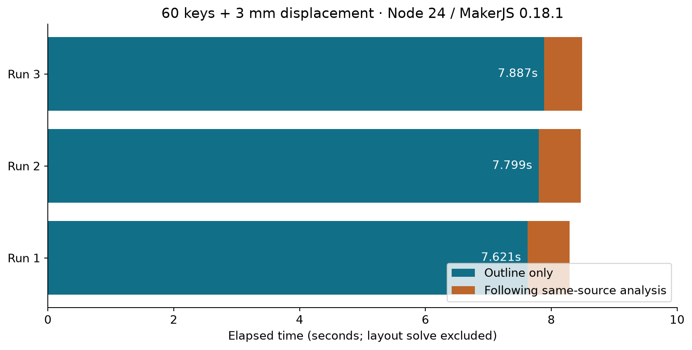
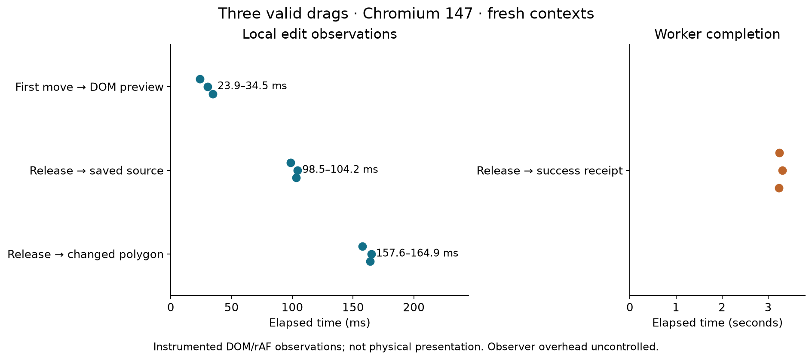
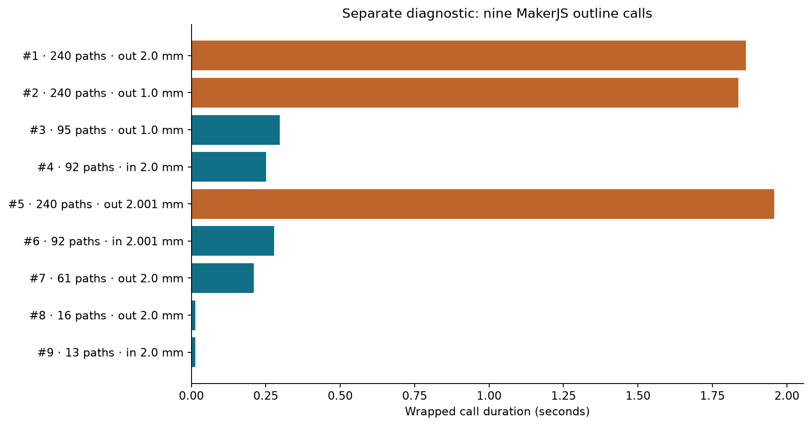

# CAD drag responsiveness and outline generation

Research scope: current staged baseline; no new production changes.

34 primary sources · 6 external domains · 30 discovery/refinement workers · 3 research waves + independent refinement · 5 executed verification bundles · 1 excursion. Assembled after 42 minutes; final review/QA follows. Two optimization claims remain unresolved and three claims were refuted.

## Findings that change the next fix

**Separate continuous dragging, committed movement, and exact outline completion.** They are different paths and need different measurements. `StudioCanvas` updates local drag state during movement and applies an SVG group translation. On release it proposes a source edit through BoardStudio’s realtime-source guard and ConfigContext edit adapter. [S32][S32] Outline work runs through the Studio worker queue. Moving every pointer event does not rewrite YAML or start ordinary auto-generation in CAD mode. [S01][S01] [S02][S02] [S04][S04] [S10][S10]

**Profile the release path first; reuse of unchanged canvas geometry is a separate rendering candidate.** The current browser probe observed long main-thread tasks around release, without attributing their cost. [Browser trace](verify-drag-final.md) A local drag-state render still maps every displayed object and recomputes `layoutPolygon`, although the temporary motion is expressed by a group translation. Cache the base points or isolate stable object children before considering a renderer rewrite. This is a source-supported opportunity, not a measured speedup. [S01][S01] [S11][S11]

**The residual outline cost is concentrated in closing and offsets in the measured fixture.** MakerJS expands paths and incrementally combines them, with intersection splitting and point-inside classification. Board Studio adds closing offsets, validation, containment and finishing. The executed profile places most inclusive outline time inside MakerJS outline calls. The existing one-shot handoff and offset memoization are already part of the baseline; proposing them again would not address the residual cost. [Profile](verify-outline-profile.md) [S07][S07] [S08][S08] [S18][S18] [S19][S19]

## Current measurements

**MEASURED, repeated engine runs:** three warmed, uninstrumented outline passes took **7.621 / 7.799 / 7.887 s**. Separate layout solves took **32–40 ms**. A direct outline→freeze→analysis experiment took **626 ms** for the following snapshot analysis and preserved the measured profile/exports. This is one difficult fixture, not a population latency estimate. [Repeated measurements](artifacts/outline-repeat.json).

**MEASURED, engine diagnostic:** on the fixed 60-key board with one key moved +3 mm, a full direct engine run took **8.51 s**. A separate warm, instrumented outline pass took **7.67 s**; nine MakerJS outline calls accounted for **6.47 s of inclusive wrapped time**, while validation accounted for about **95 ms**. These nested timings cannot be added, and the instrumented pass is not an uninstrumented benchmark. [Engine raw data](artifacts/outline-profile.json) · [Harness and scope](verify-outline-profile.md).

Snapshot-following analysis took **612 ms** in that process. Exact assertions covered `profiles.main_outline` extracted analytic paths, bounds and contour count, plus `main_outline` SVG/DXF, on this fixture. They do not establish whole-engine, PCB or case-output equality. Thus the measured priority is expensive closing/offset work, rather than assuming the cache-key miss repeats the entire outline build. The cache had already been consumed before this snapshot pass, so this is not a controlled cache-hit/miss comparison. [Engine verification](verify-outline-profile.md).

**MEASURED, browser:** three fresh Chromium contexts completed the same bounded drag and received correlated worker success. First movement→DOM preview ranged **23.9–34.5 ms**; pointerup→changed polygon **157.6–164.9 ms**; pointerup→worker success receipt **3.229–3.309 s**. Each run also recorded roughly 100 ms and 55 ms main-thread tasks around release. This points to the release path as a worthwhile drag investigation; the trace does not attribute those tasks to a particular function. [Browser verification](verify-drag-final.md).

These are exploratory instrumented observations, not physical display latency or stable tail estimates. The observer reads storage and DOM every frame, with no observer-free control. Success receipt does not mean the final outline was already visibly published. The earlier diagnosis is excluded from these results. [Probe audit](verify-drag-diagnosis-audit.md).

The separate per-call diagnostic identifies three large positive expansions: **240 paths** at distances **2 / 1 / 2.001 mm**, taking approximately **1.86 / 1.84 / 1.96 s** respectively. They have different parameters, so this does not show an identical offset missed by the existing memo. Investigate why these expansions and retries are necessary and how to reduce their input/combination work while retaining geometry parity. [Per-call records](artifacts/outline-repeat.json).

**Do not compare the browser and engine numbers as a speedup:** the browser moves `fingers_c1_r1`, while the engine fixture moves `fingers_c10_r1` by +3 mm; their endpoints also differ. [S27][S27] [S28][S28]

## Drag path and safe optimization boundaries

The current path is:

1. Capture the pointer and save the selection, source and start coordinates.
2. After the screen-distance threshold, convert coordinates, compute snapping and update local drag state.
3. Render transient translation on selected object groups while recomputing the displayed polygon point strings.
4. On release, create a proposal and perform the synchronous spacing/source checks. If a successful candidate preview is already ready, validate its pose before committing. Otherwise commit immediately when no preview error is present, then derive the draft layout and schedule analysis. [S01][S01] [S02][S02]

Application render code computes world-space polygon points; React declaratively applies both points and the group’s temporary `translate`. A `previewReady` result changes the visible report and resets translation. An imperative fast path therefore needs an explicit reset/handoff; manual mutation can conflict with React-managed attributes. [S01][S01] [S11][S11] [S30][S30]

A useful first experiment is to retain base points by immutable item identity and view side, and render the changing translation separately. Check whether layout objects retain identity before choosing the key. Wrapping `StudioCanvas` in `memo` cannot suppress its own drag-state renders. A useful boundary would isolate stable per-item children, with stable props or a correct comparator. [S29][S29] This recommendation is an inference from the current rendering path, not a benchmark result. [S01][S01] [S11][S11]

A second experiment is to sample the latest pointer position once per animation frame. It must flush the final release coordinate, preserve snapping, and cancel pending work on pointer cancellation. Browsers may already coalesce movement; another animation-frame boundary can add latency. First improve the measurement: match input to the transform it causes, or capture sustained frame-work traces with observer overhead controlled. Retain frame coalescing only if this evidence shows less work without worse first-preview or final-drop latency. [S12][S12]

Two calls to the pure `snapFrame` lookup occur in one snapping expression. Reusing the result is a small cleanup, but it is not established as a material bottleneck. Source parsing, cloning and broad context updates belong mainly to the release path and must be profiled separately. [S01][S01] [S02][S02] [S03][S03]

## Outline path and caching

`StudioQueue` keeps one running job and a replaceable pending job. Its settle timer is 180 ms; superseded work receives a revision message and can be terminated after a 1,000 ms grace timer in the normal lifecycle; the reuse defect below can prevent that timer from being rearmed. These constants are not measured end-to-end latency guarantees. Synchronous geometry cannot consume a supersession message until it yields, while worker termination can abort the running script. Revision checks separately prevent obsolete results from being accepted. Worker messaging serializes through the associated MessagePort before queued delivery; this contract does not establish the local cost of copying a payload. [S17][S17] [S04][S04] [S05][S05] [S16][S16]

The immediate outline-to-analysis cache uses prepared-scene identity and a serialized config/assets key, and is evicted on the next eligible analysis parse whether the key matches or not. It is not a persistent cache across edited boards. Within a parse, an offset cache keys by model structure and returns clones. Replacing structural keys with object identity could reduce key-building work but miss equivalent cloned models; no benefit is established. [S07][S07]

There is a specific handoff wrinkle: the worker can freeze generated outlines into source snapshots between outline-only processing and full analysis. This changes the config key and rejects the staged geometry entry. The next pass can resolve snapshots, so this does **not** prove another equally expensive outline build. The immediate freeze path measured 626 ms for following analysis in one unrandomized sample; it has no guarded-handoff counterfactual, so avoidable cache overhead remains unknown. If worthwhile, prefer a private handoff tied to the exact freeze result and prepared scene; do not globally ignore authored snapshots in the cache key. [S05][S05] [S06][S06] [S07][S07]

A longer-term dependency cache needs the transitive dependency closure: at minimum placements, matrices, units, point metadata, selected envelopes, recipes, imported asset content, injected/legacy outlines and bridge/anchor dependencies. Include implementation identity if a cache can survive a code/runtime change. Keep caches for geometric models separate from serialized exports and downstream board/case results. [S06][S06] [S07][S07] [S08][S08]

## Ranked next experiments

|Lane / priority|Experiment|Acceptance evidence|
|---|---|---|
|Correctness first|Reset the cleared grace handle when cancelling/disposal; regress cancel-during-grace → reuse → supersede|The reproduced queue must terminate obsolete work like the fresh-queue control [S34][S34]|
|Drag 1|Attribute synchronous release cost, then reduce the dominant parsing/proposal/layout/render work|Matched release-to-polygon improvement; exact source, pose and undo preserved|
|Drag 2|Reuse base polygon points; isolate moving groups|Causally matched sustained preview/frame measurements; snap and re-grab stay correct|
|Drag 3|Frame-coalesce only demonstrated redundant input work|No worse first preview or final drop; flush terminal coordinates and cancellation|
|Outline 1|Trace the three costly 240-path expansions to recipe and fallback callers; test less input/combination work|Same fixture and warmup; profile analytic paths/SVG/DXF parity plus adversarial geometry cases|
|Outline 2|Investigate immediate freeze handoff only if profiling shows avoidable work|626 ms is total following analysis, not promised cache savings; measure actual pipeline|
|Longer term|Dependency-aware recipe/component reuse|Explicit invalidation matrix; stale-source and asset-change cases|
|Deferred|Authoritative polygon-kernel replacement|Curve error, topology, erosion, clearance, exports and runtime all verified|

The release-first order is based on observed stalls, not function-level attribution. The engine profile supports prioritizing offsets over validation. It is an engineering recommendation, not a claim that each experiment will help. [S01][S01] [S05][S05] [S07][S07] [S08][S08] [S20][S20]

## Geometry correctness constrains the alternatives

Native committed geometry retains lines, circular arcs and circles as analytic primitives; authored cubic sketch curves are flattened to segments before publication. Its precision stack contains different tolerances for design acceptance, endpoint matching, simplification and serialization; there is no demonstrated composed error budget. The current finishing simplifier performs successive locally bounded edits, rather than retaining the original curve as a global error reference. Do not describe its `limit` as a guaranteed global Hausdorff bound. [S08][S08] [S09][S09]

`clipper2-ts` supplies browser-compatible boolean and offset APIs, but uses polygonal paths and approximates rounded offsets with segments. Its numeric scaling and hole hierarchy need an explicit conversion contract. Availability is not proof of faster Board Studio outlines. A render-only approximate preview is a lower-risk experiment than replacing authoritative geometry or exports. [S20][S20] [S21][S21]

An acceptable approximation experiment must preserve exact committed output and test narrow gaps, nearly tangent arcs, nested holes, disconnected regions, negative offsets, mirrored transforms and large coordinates. Include gaps around the chain-matching threshold, ignored micro-paths and solid conversion’s snap/drop behavior. These are proposed verification cases, not cases already demonstrated in this run. [S08][S08] [S09][S09] [S20][S20]

## What the external editor examples actually show

`tldraw` caches derived geometry by shape content. Excalidraw exposes a transient render-override API, but its ordinary selection drag calls `dragSelectedElements` against the scene during pointer movement; the override method is not itself an animation-frame scheduler. These sources suggest useful patterns, not a ready-made performance result for this React/SVG canvas. [S22][S22] [S23][S23]

Moving drag state to an external store or marking updates as transitions is not an established fix. `useSyncExternalStore` requires stable snapshots; subscription-triggered React updates are synchronous. In the app’s React 18 generation, `startTransition` invokes its callback immediately and may defer or interrupt the resulting render work. It does not offload computation in the handler/callback to another thread. [S14][S14] [S15][S15] [S26][S26] [S33][S33]

## Corrections and evidence limits

- **No proven capture leak:** Pointer Events requires implicit capture release after pointerup or pointercancel. Absence of an explicit release call is not itself a defect. Cross-browser execution remains separate from the normative contract. [S12][S12]
- **Queue reuse has a narrower cancellation defect:** `analysis.cancel()` disposes worker state but retains the queue object; only unmount clears its ref. A later schedule can create a worker. The terminal-queue allegation was retracted. However, an executed follow-up found that cancel during an active grace timer leaves a stale timer handle; after queue reuse, another supersession can skip forced termination. A fresh-queue control terminated correctly. Fix and regress this specific lifecycle before relying on cancellation to bound obsolete work. [S03][S03] [S04][S04] [S34][S34]
- **No duplicate ordinary auto-generation during CAD:** the context cancels and gates it while CAD is active. [S10][S10]
- **Historical timing ratios were not matched experiments:** the earlier engine baseline included logging and output work; the later harness was warmed and excluded layout solving. Earlier browser preview, committed polygon and worker receipt timings were different endpoints. See the [raw-harness audit](wave-1-skeptic_final.md).
- **One invalid React RFC permalink was rejected and replaced** with a verified file-history commit. Separate React pages remain one provenance family. [S26][S26]

Continuous pointer movement is excluded from Event Timing's eligible events. INP can reflect eligible drag endpoints, but cannot characterize continuous motion responsiveness by itself. Measure event-to-DOM-preview observation, frame intervals, release-to-committed layout and worker completion separately. A DOM observation in `requestAnimationFrame` confirms callback-visible state during a rendering update; it is not proof that pixels were physically presented. [S31][S31] Long Animation Frames can identify long frames but do not capture every missed refresh deadline. Synthetic Playwright input also does not reproduce a physical mouse's hardware sampling. [S13][S13] [S24][S24] [S25][S25]

## Reproduction and provenance

Browser: [exact producer](artifacts/drag-final.cjs), [raw samples](artifacts/drag-final.json), [scope and hashes](verify-drag-final.md). Engine: [exact producer](artifacts/outline-repeat.cjs), [raw samples](artifacts/outline-repeat.json), [scope and hashes](verify-outline-profile.md). Shared [fixture](artifacts/fixture-60.yaml) and [baseline identity](artifacts/baseline-identity.json). The scripts retain original temporary paths; reproduction setup is documented in [REPRODUCE.md](REPRODUCE.md). [Cleanup receipts](cleanup.md). All new research probes run outside production source files. Existing staged changes are the baseline and are preserved.

The [source ledger](source-ledger.md), [claim graph](claim-graph.md), [intent comparison](intent-diff.md), [observation manifest](observation-manifest.md) and [expansion log](expansion-log.md) record the evidence and its limits. Recommendations without intervention evidence remain explicitly provisional.

## Remaining limits and method

No optimization intervention was benchmarked in this research. The rAF and polygon-cache benefits, alternative-kernel speed, native presentation latency, multi-selection snapping and broad cancel/amend races remain unproven. The queue grace defect is the confirmed narrow lifecycle exception. The [lead dispositions](lead-dispositions.md) distinguish investigated findings from explicit future experiments.

Discovery used fifteen independent axes and two expansion waves; a separate fifteen-member team challenged the evidence and report. Five executed verification bundles cover the initial rejected browser diagnosis, corrected browser run, engine profile, engine repeats and queue/control proof. One bounded excursion established the queue defect. Sources are primary code, standards, implementations and archived executions; multiple readers do not multiply independent datasets.

## Sources

See the [numbered source ledger](source-ledger.md). API claims use explicit primary-source exceptions; runtime conclusions rest on the archived experiments, not on repeated readers of the same page.

[S01]: ../../../app/src/molecules/StudioCanvas.tsx "Canvas pointer and rendering code"
[S02]: ../../../app/src/utils/studioMove.ts "Drag proposals and snapping"
[S03]: ../../../app/src/hooks/useStudio.ts "Studio hook and queue"
[S04]: ../../../app/src/utils/studioQueue.ts "Worker queue"
[S05]: ../../../app/src/workers/studioPipeline.ts "Studio worker pipeline"
[S06]: ../../../app/src/utils/studioOutline.ts "Outline source preparation and snapshots"
[S07]: ../../../engine/src/designs/index.js "Outline geometry and memoization"
[S08]: ../../../engine/src/designs/geometry.js "Offset, validation and containment"
[S09]: ../../../engine/src/designs/finishing.js "Finishing and simplification"
[S10]: ../../../app/src/context/ConfigContext.tsx "CAD auto-generation gate"
[S11]: ../../../app/src/utils/layoutDrawing.ts "World polygon generation"
[S12]: https://www.w3.org/TR/pointerevents3/ "Pointer Events Level 3"
[S13]: https://www.w3.org/TR/event-timing/ "Event Timing API"
[S14]: https://react.dev/reference/react/useSyncExternalStore "React external-store contract"
[S15]: https://react.dev/reference/react/startTransition "React transition execution"
[S16]: https://html.spec.whatwg.org/multipage/workers.html "HTML worker lifetime and communication"
[S17]: https://html.spec.whatwg.org/multipage/web-messaging.html#message-port-post-message-steps "MessagePort structured serialization"
[S18]: https://github.com/microsoft/maker.js/blob/77a8779cdd7037efad1be8aac951adb4d06acb50/packages/maker.js/src/core/expand.ts "MakerJS incremental expansion"
[S19]: https://github.com/microsoft/maker.js/blob/77a8779cdd7037efad1be8aac951adb4d06acb50/packages/maker.js/src/core/combine.ts "MakerJS boolean combine"
[S20]: https://github.com/countertype/clipper2-ts/blob/bf6e0303217bdffcbe2f03ab7f6218194df8e7e4/README.md "Clipper2 TypeScript port and precision limits"
[S21]: https://www.angusj.com/clipper2/Docs/Units/Clipper.Offset/Classes/ClipperOffset/Properties/ArcTolerance.htm "Clipper offset arc tolerance"
[S22]: https://github.com/excalidraw/excalidraw/blob/97c68dd371e13c017a8dcca49f8b3995ba7890a8/packages/excalidraw/components/App.tsx "Excalidraw drag and transient override implementation"
[S23]: https://github.com/tldraw/tldraw/blob/05ba06d341d4fc7212812c30cb80309c011d428a/packages/editor/src/lib/editor/Editor.ts "tldraw geometry caches"
[S24]: https://www.w3.org/TR/long-animation-frames/ "Long Animation Frames specification"
[S25]: https://playwright.dev/docs/api/class-mouse "Playwright mouse automation"
[S26]: https://github.com/reactjs/rfcs/blob/dd61503420de363abfeb0e4cffeee7b6d241b13e/text/0214-use-sync-external-store.md "Corrected React external-store RFC"

[S27]: artifacts/drag-final.json "Corrected browser runtime evidence"
[S28]: artifacts/outline-repeat.json "Repeated engine runtime evidence"
[S29]: https://react.dev/reference/react/memo "React memo and local state"
[S30]: https://react.dev/learn/manipulating-the-dom-with-refs#best-practices-for-dom-manipulation-with-refs "React DOM-ref ownership guidance"
[S31]: https://html.spec.whatwg.org/multipage/webappapis.html#update-the-rendering "HTML rendering update ordering"
[S32]: ../../../app/src/molecules/BoardStudio.tsx "BoardStudio commit adapter"
[S33]: https://github.com/facebook/react/blob/v18.3.1/packages/react/src/ReactStartTransition.js#L14-L36 "React18 immediate transition callback"
[S34]: verify-queue-grace.md "Executed queue reuse grace proof"
