# Changelog

## Faster layout edits and outlines

September 20, 2026

Adding or removing keys, rows, and columns now updates the project in batches,
reducing pauses on larger keyboards. Automatic board outlines generate faster
while retaining authored layouts, electronics, and source comments.
Repeated automatic outline updates also reuse managed regions instead of adding
unused recipes to the project.

## Snapping settings beneath the tool

September 13, 2026

Use the chevron beneath the magnet to slide snapping settings open inside the
rail. Only the compact settings section expands, pushing later tools down.
The tool strip keeps its width; short screens scroll the settings.
Settings retain their values when closed.
The magnet still toggles snapping; Escape closes settings and restores focus.

## BHK rows and columns

September 12, 2026

BHK now uses editable, named rows and columns instead of fixed key positions.
Its 33 keys retain their placement, thumb angles and electrical assignments.
Select rows from the canvas or Objects tree, then use Inspector to adjust keys
or add/remove individual cells. Matrix resizing preserves intentional holes.

## Continuous editing and automatic outlines

September 11, 2026

Edits save immediately while solving and outline updates run in the background.
Consecutive moves accumulate without waiting; conflicts stay visible for repair.
The canvas keeps its camera position and previous outline during updates.

**Automatic outline** rebuilds managed recipes after edits. Turn it off to freeze
the exact contour; **Rebuild outline** updates it manually. Custom outlines stay
unchanged. Generated outline updates share the originating edit’s undo step.

## Layout expressions and physical alignment

September 12, 2026

Setup retains pitch formulas and offers separate dimensions for new keycaps.
Snapping follows splayed edit frames, keeps a free axis on the grid, and offers
footprint origins separately from physical centers. Set distance now accepts a
canvas target. Row guides account for mixed key sizes; mirrored sheets retain
switch cutouts. Mechanical sections show declared component heights.

## Fewer settings, clear inheritance

September 12, 2026

Design setup owns board pitch; renaming a board preserves existing spacing.
The Inspector has one matrix Spacing section. One assembly editor exposes Board,
matrix, column and key scopes, with **Reset to inherited** and preserved overrides.

**Snapping** now combines increments, guides and component edge gap. After a
snapped drop, **Keep relationship** retains either center alignment or edge offset.
Setup and Case reuse the mechanical stack editor, showing gap and derived plate
height together.

## Units, alignment and in-place setup

September 12, 2026

Enter stagger and spacing as `0.5u` or `0.25v`, with millimetres shown beside the
value. Quarter-unit snapping is the default; switch increments in the canvas pill.
Drag to key, component, row or column centers, then choose **Keep aligned** to
retain the relationship. The Inspector also exposes alignment, distance and equal
spacing controls.

New boards start empty. **Design setup** stays beside the workspace and groups
spacing, topology, per-key electronics and mechanical layers. Preview the real
switch/diode/LED footprints and generate a separate KiCad sample. Add matrices,
MCUs, encoders and other hardware directly in Layout.

Foam, silicone and gasket layers occupy existing assembly gaps. Thickness and
compression show fit without moving the stack. Export fitting layers separately
as DXF files, with material metadata and nominal 3D references.

## A consistent CAD workspace

September 11, 2026

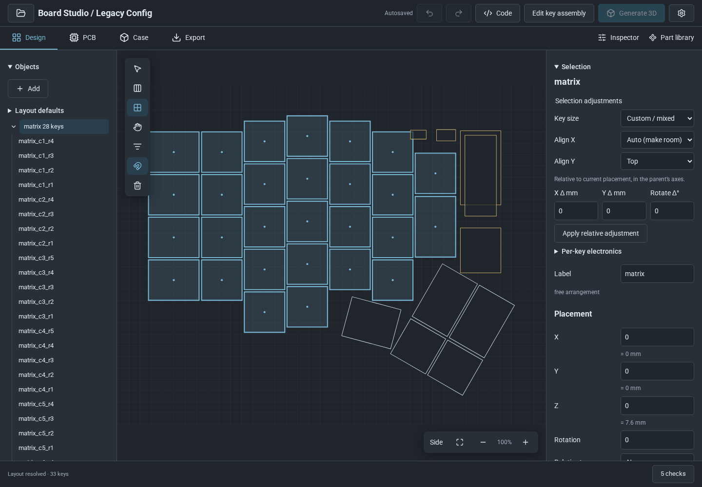

Board design and part editing now share a compact graphite interface with blue
selection, aligned controls, and consistent panes. Desktop starts with the object
browser and properties beside the canvas. Mobile uses a focused inspector drawer.

Part save and undo stay visible while editing models. Browsing other parts or
returning from board editing preserves unsaved drafts. Model number fields accept
replacement values without snapping back mid-edit; Enter commits and Escape
cancels.

## Clear canvas and key resizing

September 11, 2026

Open **Inspector** beside the canvas tools for Objects, Selection and Design.
Both sidebars and automatic selection popups are replaced by this manually opened
panel. Sections remember their expanded state during the session.

**Auto (make room)** grows outside keys outward. Interior resizing adjusts native
spacing in one undoable edit, preserving authored offsets. Unresolved clearance
is reported and blocks fabrication exports.

## A simpler design workflow

September 11, 2026

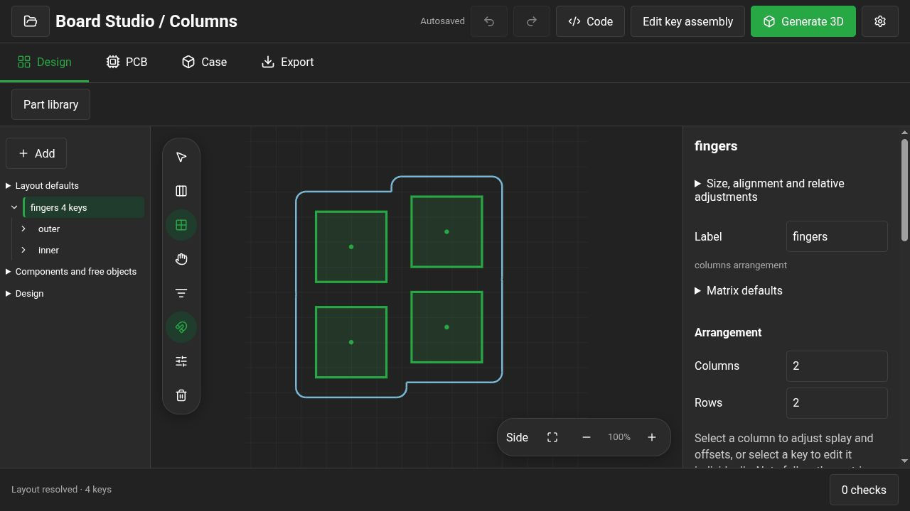

Layout and component placement now share **Design**. Continue through **PCB**,
**Case** and **Export** without losing generated geometry when opening Code or
the part library.

**What changed:**

- **Direct start:** Open Board Studio immediately. New projects skip setup;
  file, repository and example imports are available from Projects.

- **One generation action:** Generate 3D and the editor shortcut share a build.
- **One export destination:** Download source, portable projects, boards and case
  files from Export. Case review resets when geometry changes.
- **Settings stays in context:** Keep the current stage, selection and camera.
  Advanced library code appears when an entry is selected.
- **Explicit case creation:** Opening Case leaves the source and undo history
  untouched until you choose Create case.
- **Board outline recovery:** Rebuild board outline fills incidental voids and
  retains component envelopes, layout positions, and authored finishing settings.
  Explicit hole preservation remains supported; one undo restores the prior design.
- **Reliable editing:** Unfinished YAML keeps its editor, and legacy automatic
  generation no longer starts extra native builds.

## Direct layout editing

September 10, 2026

The canvas now has a floating tool pill with Objects, Columns and Matrices at the
top. Selection opens the relevant quick controls; owned electronics fold beneath
keys in a smaller tree.

Drag components directly, use Ctrl/Cmd to toggle selections and Shift to select a
range. Snapping preserves layout spacing and checks nearby envelopes. Components
can keep a snapped target and offset. Drops retain their visible position while
validation finishes, without refitting the camera.

Delete removes the selection as one undoable edit, including owned components.
Locks and external references remain protected; text fields retain normal Delete
behavior. Phone controls fit the screen and quick edits stay above the zoom pill.

## Reliable setup and assembly edits

September 10, 2026

Growing a new design now adds complete switch, diode and LED assemblies. New keys
inherit matrix nets and scoped templates; linked halves retain separate wiring.
Assembly offsets move the switch clearance body with its footprint and preserve
manual model and wiring overrides.

Saved setup drafts receive the corrected LED input/output mapping and keycap-based
outline where their generated definitions are unchanged. Custom wiring remains
visible for review. Shrinking a matrix asks before removing edited keys, and Undo
restores setup source, models and footprint overrides together.

## PCB viewer recovery

September 10, 2026

Load KiCanvas on demand with a revisioned asset URL. Keep PCB source hidden
during startup and offer retry when loading fails. Unconnected pads no longer
crash net-label rendering. Downloaded PCB data remains unchanged.

Studio now initializes new cases safely, preserves key offsets, and opens the
case from the footprint preview action. Editing during generation releases the
Generate button while keeping old results marked stale.

Bundled component assets and the PCB viewer now load offline after the app installs, including the first new design.

## WRL preview recovery and nice! models

September 10, 2026

Resolve locally packaged WRL models without downloading a project-relative path.
Cached previews now follow portable model paths even when an imported binding
has no asset identifier.

The model editor includes bundled nice!nano v2 and nice!view STEP models, with
source attribution and noncommercial licensing shown. New-design nice!nano
previews and exports include its model. Confirm alignment and socket height.

## New-design setup workspace

September 10, 2026

Start with a matrix, optional thumbs and key assembly settings in one workspace.
Edit switch, diode and LED positions with numeric controls, dragging or keyboard
nudging. Named templates retain embedded project snapshots when the personal
library changes.

- Reopen setup while preserving manual layout edits.
- Generate native owned diode/LED objects and deterministic matrix nets.
- Preview bundled switch and selected controller STEP models locally.
- Keep unresolved catalogue and electrical choices visible as draft blockers.

The initial catalogue remains under verification. See
[component coverage](./public/components/README.md) for missing models and
unverified split-link and wireless combinations.

## Parametric Board Studio

September 10, 2026

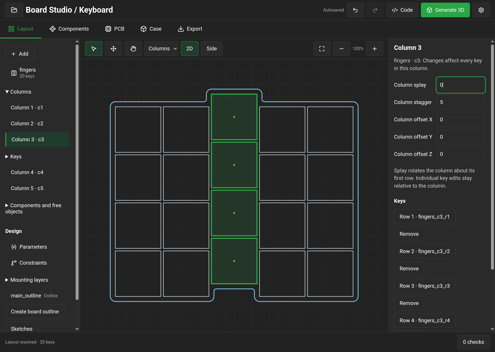

Designing a keyboard previously required switching between source edits, layout
previews and a separate case draft. Native projects now share one editable
workspace from layout through manufacturing review.

**What changed:**

- Create a matrix by row and column count, then select keys, columns or clusters.
- Add clusters beside existing keys and keep editing when an outline needs repair.
- Navigate nested cluster, column and key branches; delete clusters with Undo.
- Choose MX keycap size presets or enter custom width and depth.
- Keep outside edges aligned, or choose explicit horizontal/vertical alignment.
- Quick-edit keys, columns and matrices with relative movement and rotation.
- Save layout spacing, key size and optional diode/LED defaults for new keys.
- Rebuild the current outline after placement, preserving its finishing settings.
- Adjust whole-column splay and offsets; add, remove or rotate individual keys.
- Assign row and column nets automatically while retaining explicit overrides.
- Edit thumb arcs, linked mirrors and named dimensions.
- Apply alignment, distance, angle, equal-spacing and symmetry constraints.
- Place components on physical layers and inspect their height and stacking.
- Share autosave and undo between the canvas, inspector, Code and case tools.
- Pan and zoom the canvas, with full editing panels on phones.
- Download current PCB files and outlines; review case checks before exporting solids.

## CNC corners adapt to the cutter

September 09, 2026

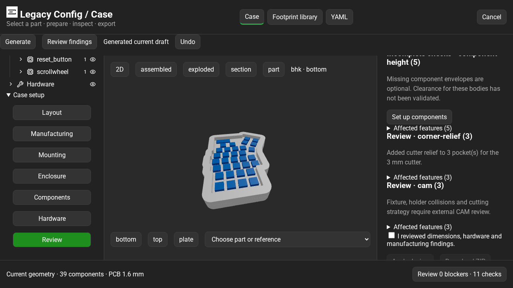

Choosing CNC now adds cutter-sized corner relief during case generation. Each
part uses its own cutter; switch openings keep their required clearance.

Relief is checked against walls, plate webs and mounting posts before cutting.
Findings identify pockets that need a smaller cutter or more surrounding
material. Rotated relief arcs no longer produce false sharp-corner warnings.

## Gasket mounting and direct plan editing

September 09, 2026

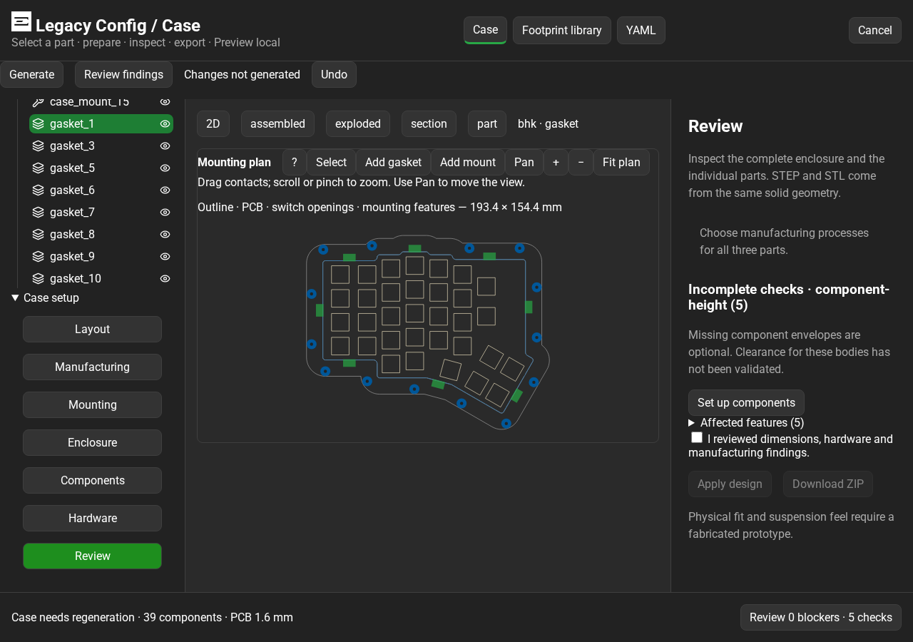

Gasket mounting removes incompatible rigid supports. Saved conflicts have a
Remove rigid supports action that keeps existing contacts in place.

Automatic contacts avoid short corner spans and use the actual rotated component
contours, restoring space beside thumb clusters. BHK's nine old gasket anchors
and six Corne screw-hole objects are removed from the native example.

The 2D plan supports wheel and pinch zoom, panning, and Fit. Dragging preserves
the grab offset; the contact editor sits below the canvas and hints dismiss during
manipulation. Inline YAML mounting edits remain valid and undoable.

Reload BHK from Examples to use the cleaned configuration.
[Phone preview](./public/images/changelog/bhk-gaskets-412.png).

## Reliable native analysis and imported enclosures

September 09, 2026

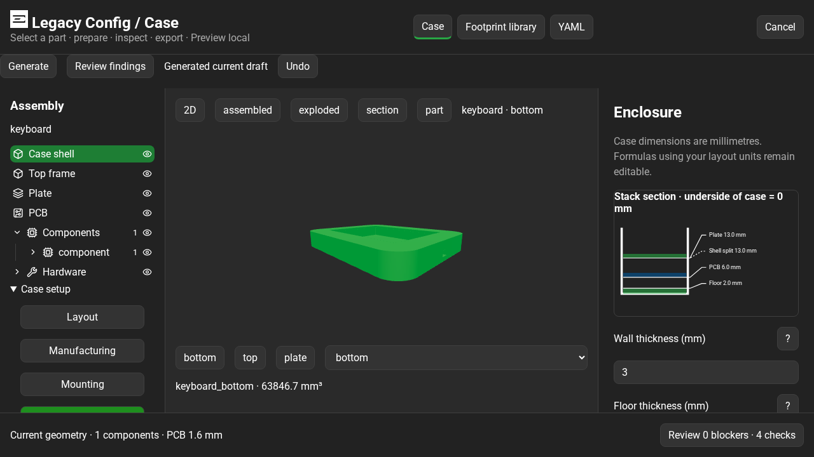

Mounting edits retain clearance blockers and standalone PCB downloads.
Imported-board enclosures include native batteries and service openings.
Moving an aliased key adds to its existing offset and preserves undo.

## Simpler transitions and configurable inside corners

September 09, 2026

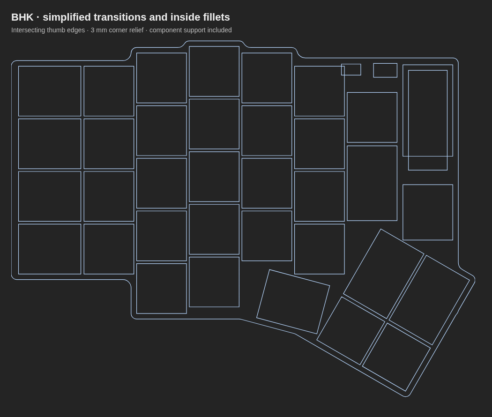

BHK now extends the neighboring thumb edges to meet, removing the short jogs.
Inside corners use 3 mm fillets, including the shallow column steps.

Set `simplify: 8` to bound local edge simplification. Choose
`corners: {fillet: 3}` or `corners: {chamfer: 3}` for corner relief.
Chamfer mode converts both inside and outside corners to straight segments.
Shallow column steps now use one clean diagonal instead of several small facets.
[Chamfer preview](./public/images/changelog/bhk-chamfer-corners.png).
Required key/component support and pad containment remain checked.

Reload the BHK example to apply these settings to an existing workspace.

## BHK follows the outside key edges

September 09, 2026

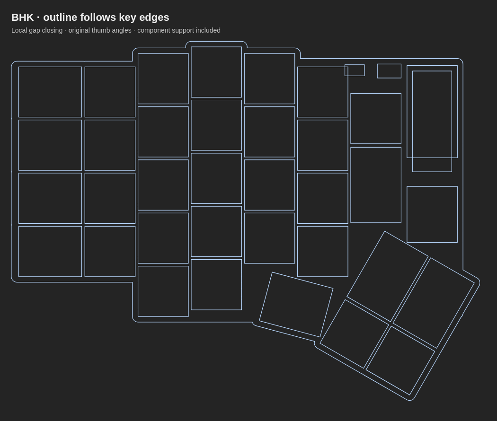

The BHK outline now follows the exposed key edges, including the change in thumb
angle. Default tight wrapping closes local key gaps; the inward bottom bridge
fills the enclosed sliver. Component support and pad containment remain checked.

Reload the BHK example to use the updated outline.

## Straight outline transitions and control support

September 09, 2026

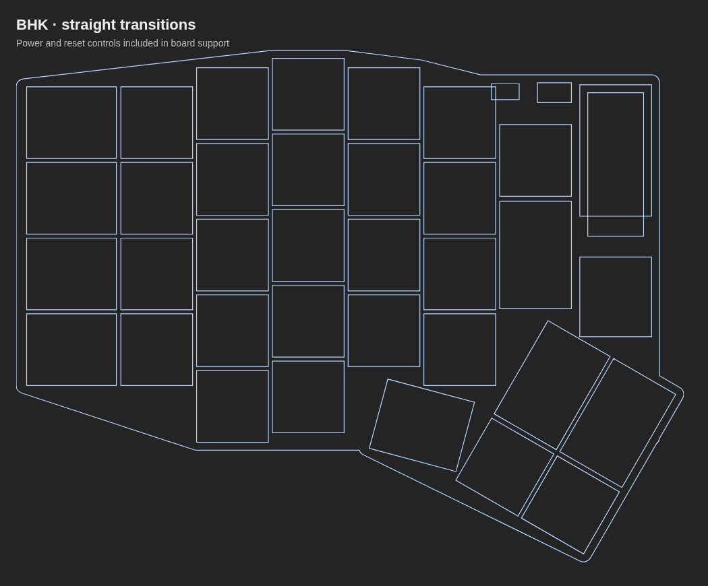

BHK now includes its power switch and reset button as independent components.
Their board-support areas contribute to the electronics boundary, preserving
all existing electrical placements. A pad-area check reports off-board pads
with their footprint reference and source binding.

Choose tight, hull or box wrapping per cluster. BHK uses key-cluster hulls, a
rectangular electronics bay and bridges aligned to shared top, bottom and right
edges. These remove the remaining notches and follow later layout changes.

Reload the BHK example to apply the new source to an existing workspace.

## BHK outline and configuration repair

September 09, 2026

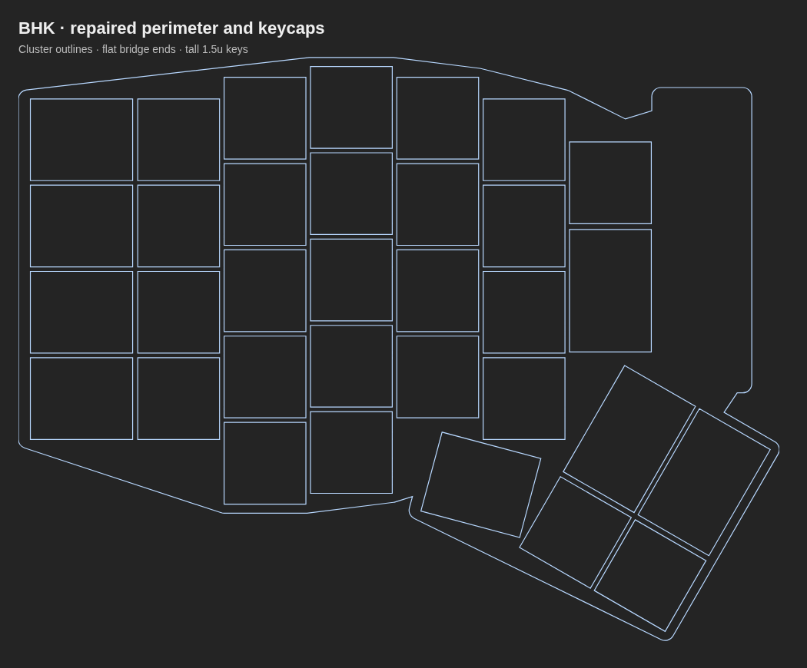

BHK now wraps each cluster and uses flat bridge ends, removing the accidental
interior sliver and round electronics lobes. Its 1.5u keycaps are tall, while
switch openings and electrical placements retain their original geometry.

Shared part bindings reduce the example from 4,317 to 1,044 lines. Keys carry
placement, wiring and reference overrides. Reload the BHK example to use the
repair; existing saved YAML retains its authored boundaries.

## Native layout and physical layers

September 09, 2026

Native designs use `schema: ergogen/v1`. Keys, components, mounts, and reference
anchors have distinct roles. Automatic boundaries consume named physical
envelopes and explicit cluster bridges.

**What changed:**

- Layout editing with top/side views, local overrides, mounting layers, and locks.
- Physical stacking: displays can sit above controllers while batteries follow
  the case floor. Clearance findings retain missing measurements.
- Native examples, including BHK with preserved footprint/pad placement and a
  new automatic perimeter.
- Legacy saved sources remain readable and downloadable; generation requires
  the native schema.

## CAD workspace and reusable footprints

September 8, 2026

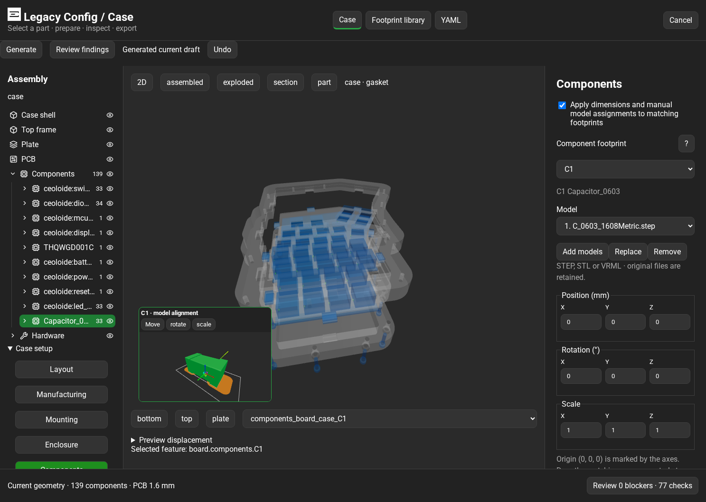

Case design now uses an assembly tree, central canvas and contextual inspector.
Case tools, a searchable footprint library and YAML share one workspace.

Import KiCad footprints in batches, map pads to nets and align multiple models.
Saved library revisions update explicitly linked projects while retaining instance
parameters and model overrides. Generation stays explicit; failed builds preserve
the last valid preview. Portable ZIPs retain library snapshots and cached assets.

## Quieter setup and faster mounting edits

September 8, 2026

Repeated component findings now live in grouped Review entries. Optional
footprint setup applies measured dimensions or models to matching placements;
missing dimensions warn about unchecked clearance without blocking generation.
Enter a mount/gasket count to distribute contacts, then tweak individual ones.
Mount edits reuse resolved outlines and batch YAML updates.

## Guided mounting and explicit case generation

September 8, 2026

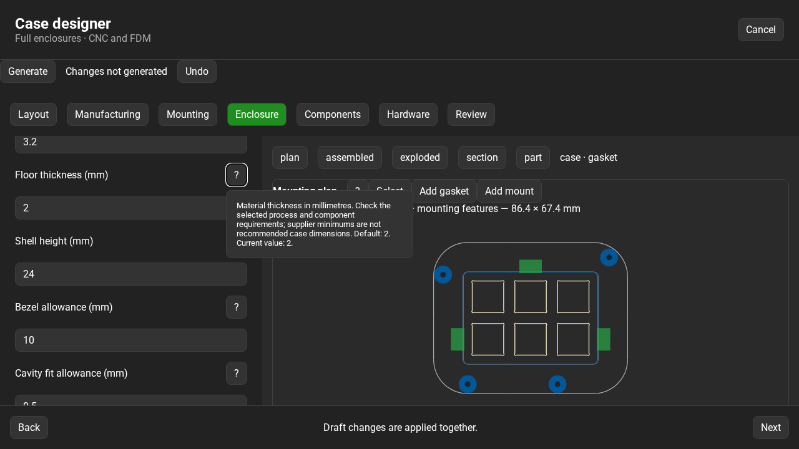

Choose mounting and manufacturing up front. The case designer now creates
mounting drafts from a 2D analysis, with direct placement editing, keyboard
movement, undo and preserved manual positions. Settings include accessible help.

Generate builds an explicit revision. Changes retain the last successful 3D
result and disable Apply/export until regenerated. Imported KiCad boards supply
component placements and thickness; guided model association packages STEP,
STL and VRML assets with exported projects. A separate middle frame can conceal
gaskets while retaining the switch plate.

The JLCCNC aluminium preset records supplier sources, depth-dependent tooling
and explicit switch corner relief. Missing dimensions and invalid combinations
produce repair guidance before or during generation.

## Full enclosure designer

September 8, 2026

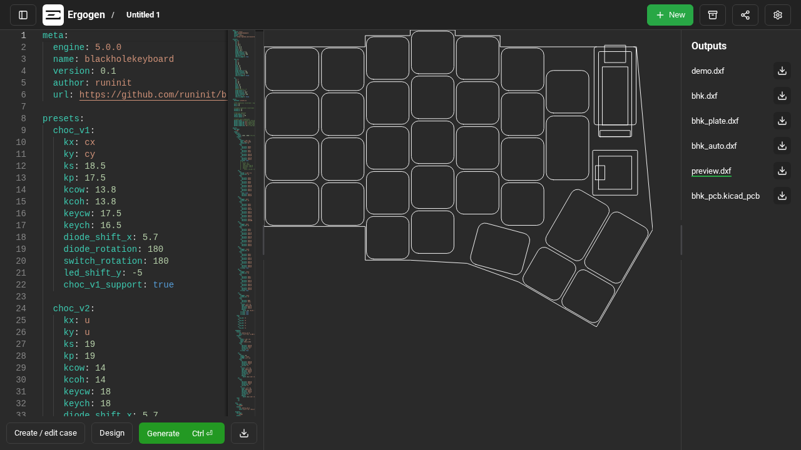

Create cases with continuous walls, separate shells and a switch plate. The
guided designer supports tray, top, bottom and floating gasket mounts, with
pad or sleeve interfaces and independent case screws.

Choose FDM or CNC per part, review declared manufacturing limits, and export
STEP/STL from the same solids. Draft previews stay separate until Apply; Cancel
discards edits. The original BHK design remains available with its complete
outlines and PCB. The migrated enclosure example was removed because it changed
the board boundary and omitted PCB generation.

Point checkboxes now preserve the remaining selections and valid YAML. Failed
previews retain profile choices, and existing board outlines can resolve a
disconnected boundary.

## KiCad 10 support

September 7, 2026

Ergogen GUI 0.19.0 generates native KiCad 10 boards with
`@runinit/ergogen@5.0.0`. Explicit KiCad 5/8 templates remain available.

The viewer resolves named nets consistently across pads, tracks, arcs, vias,
and zones, including empty and numeric-looking names. Preview failures explain
that the original PCB remains downloadable. Deployment under `/ergogen-gui/`
supports workers, routing, and offline reload.

## SVG Outlines & Offline PWA Settings Integration

July 16, 2026

Previously, custom outline injections were restricted only to JavaScript files, preventing designers from dropping vector SVG files directly into their keyboard configuration folder. Additionally, discovering and trigger-promoting PWA installation on Android and desktop devices depended on browser-specific heuristics, resulting in poor user engagement.

To improve custom drawing support and PWA usability, we implemented native SVG file outline parsing that dynamically wraps vector path definitions in the native `svg_paths_to_outline` helper, allowing `.svg` outlines to load seamlessly alongside other assets. We also added a dedicated **"Offline"** settings group inside the settings panel with an interactive **"Offline App"** button option, utilizing the captured `beforeinstallprompt` event to enable on-demand installation.

**What changed:**

- **Native SVG Outlines**: Dropping or loading ZIPs containing `.svg` outline files now parses them dynamically and integrates them into standard outlines utilizing the `svg_paths_to_outline` wrapper.
- **Offline Settings Group**: Added an interactive "Offline App" button option under a dedicated Offline settings group, displaying custom states ("Install App", "Installing...", "Installed", "Unavailable") depending on browser and installation status.
- **Dynamic Require Resolvers**: The worker's custom require resolution now handles relative template requires like `../../packages.json` to prevent runtime crashes.
- **Thematic Warning Badges**: The share compatibility warning dialog has been enhanced with warning badges, and floating alerts notify users if outline features are gated.

## Build Stack Modernization Benchmark Report

July 16, 2026

Previously, our local development, dependency installation, and production build pipelines relied on a legacy Yarn v1 and Create React App (Webpack) setup. As the codebase grew and integrated heavier computations (such as Web Workers and three-dimensional previews), compilation times slowed, dependency installs became a bottleneck, and the bundle footprint expanded significantly.

To assess the benefits of our recent shift to Vite, Vitest, and pnpm, we ran a comprehensive benchmark comparing the legacy stack against the modernized stack. Spanning 10 distinct iterations using Node v24.18.0, the benchmark measured clean install times, build times, test execution speeds, and production asset sizes. The Vite and pnpm stack achieved a 2.6x speedup in clean dependency installation and a 1.75x speedup in build times, while shrinking the total built application footprint by over 62.7%.

| Metric                    | Legacy Stack (Yarn + Webpack) | Modernized Stack (pnpm + Vite) | Difference / Speedup            |
| :------------------------ | :---------------------------- | :----------------------------- | :------------------------------ |
| **Toolchain Versions**    | Node v24.18.0, Yarn v1.22.22  | Node v24.18.0, pnpm v11.13.0   | -                               |
| **Clean Install Time**    | 45.03 seconds                 | 17.14 seconds                  | **2.63x faster** (-27.89s)      |
| **Avg. Production Build** | 31.76 seconds                 | 18.14 seconds                  | **1.75x speedup** (-13.62s)     |
| **Min. Production Build** | 30.80 seconds                 | 17.33 seconds                  | **1.78x speedup** (-13.47s)     |
| **Max. Production Build** | 33.00 seconds                 | 19.51 seconds                  | **1.69x speedup** (-13.49s)     |
| **Avg. Unit Test Run**    | 3.88 seconds (Jest)           | 5.03 seconds (Vitest)          | 1.30x slower (+1.15s)           |
| **Production Build Size** | 22.31 MB (44 files)           | 8.33 MB (35 files)             | **62.7% reduction** (-13.98 MB) |

**What changed:**

- **pnpm Dependency Resolution**: Clean install times improved by 2.63x, leveraging pnpm's content-addressable store to bypass redundant downloads and linkages.
- **Vite Production Bundler**: Production builds sped up by 1.75x on average, reducing wait times to just 18.14 seconds.
- **Built Footprint Reduction**: Production bundle size was reduced by 62.7% (from 22.31 MB to 8.33 MB) by eliminating CRA/Webpack bundle overhead.
- **Unit Testing Transition**: Documented a slight overhead in cold Vitest runs (5.03s vs 3.88s Jest), though Vitest offsets this with its near-instant watch mode during active development.

## Concurrent Bulk Export & Abstract Git Provider Architecture

July 15, 2026

Previously, exporting multiple keyboard configurations progressively occurred sequentially, which blocked compilation speed and underutilized multi-core CPU architectures. In addition, importing custom layouts from remote repositories was locked to GitHub, making it difficult to host and load configurations from alternative git providers like Codeberg.

To resolve this, we implemented a concurrent compilation worker pool that compiles configurations in parallel up to hardware limits, listing active builds dynamically as they complete. We also introduced an abstract Git Provider registry, supporting both GitHub and Codeberg repositories with a unified input that auto-detects the provider from the pasted URL.

**What changed:**

- **Concurrent Compilation Pool**: Refactored the bulk zip exporter to compile configurations in parallel using a pool of Web Workers up to CPU concurrency limits
- **Active Compiling List**: Updated the bulk download dialog to display a bulleted, dynamic list of active configurations compiling in parallel
- **Abstract Git Registry**: Created `GitProvider`, registering `GitHubProvider` and `CodebergProvider` to modularize remote configuration fetching
- **Codeberg URL Parameter Support**: Accepted `?codeberg=` URL parameters to load remote configurations from Codeberg
- **Auto-Detect Dropdown UI**: Renamed the Welcome page loader to "From Repo" and added a source selector dropdown that auto-detects pasted provider URLs
- **Version Bump**: Updates the application version to 0.16.0

## Unified Ergogen Bundle Loader and REST Directory Restructuring

July 15, 2026

Previously, loading custom Ergogen configurations and injection files (footprints, outlines, and templates) from ZIP/EKB archives or GitHub repositories was handled by duplicate, ad-hoc validation and parsing logic. Additionally, exported output files (PCBs, outlines, cases, etc.) were placed at the root of generated archives, causing folder namespace conflicts with input injection folders (specifically `outlines/`).

To resolve this, we introduced a unified [ergogenBundleLoader.ts](file:///Users/mmassarelli/Documents/GitHub/ergogen-gui/src/utils/ergogenBundleLoader.ts) library that centralizes archive extraction, structure validation, file size limits (50MB for archives, 10MB for text configs), and injection projection. The Welcome page was updated to provide visual spinner indicators, disable concurrent input interactions, and display counts of loaded components in a global notification banner. Lastly, the ZIP generation pipeline was restructured to write all generated outputs under an `outputs/` subdirectory, completely resolving naming collisions. We have also bumped the version to 0.15.0.

**What changed:**

- **Centralized Bundle Loader**: Created `ergogenBundleLoader.ts` to host unified validation, file size enforcement, and zip extraction logic.
- **Visual Loading Indicators**: Integrated spinner animations inside Welcome page action buttons and disabled dropped input interactions during loading.
- **REST Outputs Restructuring**: Modified the ZIP exporter to store all generated compilation outputs under an `outputs/` directory inside exported archives.
- **In-App Load Summaries**: Introduced a global info banner to display a summary of loaded custom libraries.
- **Version Bump**: Updates the application version to 0.15.0.

## End-to-End Binary STL Export and Preview Pipeline

July 15, 2026

Previously, generating and exporting 3D cases suffered from significant overhead due to UTF-8 decoding of compiled binary buffers inside the JSCAD background worker, string search-and-replace of ASCII headers, and subsequent re-encoding using TextEncoder back to ArrayBuffers on the main thread for 3D rendering. This constant conversion between binary arrays and strings slowed down 3D generation times and limited performance on larger meshes.

To resolve this, we implemented an end-to-end binary STL pipeline. The background JSCAD worker now requests the binary STL format (`stlb`) directly from the compiler, returns the raw ArrayBuffer to the main thread, and avoids all string-decoding and header regex steps. The Three.js previewer and ZIP download utilities have been refactored to accept ArrayBuffers and Uint8Arrays natively, bypassing any encoding overhead. We have also bumped the version to 0.12.0.

**What changed:**

- **Binary JSCAD Worker Output**: Configures the JSCAD worker to compile to binary `stlb` format and extract raw ArrayBuffer results directly
- **Bypassed String Decoding**: Eliminates worker-thread UTF-8 string decoding and regex-based header replacements
- **Direct 3D Preview Parsing**: Bypasses main-thread `TextEncoder` operations, feeding the ArrayBuffer directly to the binary STL parser in StlPreview
- **Raw Binary Exports**: Emits binary files directly into generated ZIP archives without conversion overhead
- **Version Bump**: Updates the application version to 0.12.0

## Conditional Dependency Installation in CI/CD

July 15, 2026

Previously, deploying or building the application in environments with a custom `ERGOGEN_VERSION` environment variable specified would lead to workflow errors. The build workflow in GitHub Actions enforced `yarn install --frozen-lockfile`, but the custom `ERGOGEN_VERSION` automatically triggers a preinstall hook that modifies the dependency mapping in `package.json`. This mismatch between `package.json` and the lockfile caused the workflow to fail unless developers manually aligned `yarn.lock` locally before each deployment.

To solve this, we updated the GitHub Actions workflow to conditionally execute the dependency installation. If a custom `ERGOGEN_VERSION` is specified, the workflow runs `yarn install` instead of enforcing `--frozen-lockfile`. This allows the package manager to dynamically update the dependency tree and resolve the custom version in memory. If no custom version is set, the workflow defaults back to `--frozen-lockfile` to guarantee standard reproducible builds. We have also bumped the version to 0.11.13.

**What changed:**

- **Conditional Install Workflow**: Checks for the presence of the `ERGOGEN_VERSION` environment variable before selecting the installation command
- **Flexible Custom Builds**: Dynamically updates the dependency tree in memory when running custom Ergogen versions, preventing lockfile mismatch errors
- **Standard Build Safety**: Guarantees identical, frozen lockfile builds for all standard releases where no override version is specified
- **Version Bump**: Updates the application version to 0.11.13

## Resolved Build Type Constraints

July 15, 2026

Previously, compiling the application encountered strict TypeScript constraints on configuration object parsing. The return type signature of `parseConfig` inside the configuration context incorrectly assumed section values were arrays (`unknown[]`), resulting in invalid type casting conflicts and compilation failures when resolving PCB properties.

To address this, we corrected the type signature of `parseConfig` inside `src/context/ConfigContext.tsx` to return `Record<string, unknown>`. We also reverted the experimental Ergogen compiler upgrade, maintaining the stable library versions.

**What changed:**

- **TypeScript Type Resolution**: Refactors the parsed configuration parser types to allow safe type casting of configuration sections
- **Reverted Compiler Upgrade**: Discards the experimental Ergogen upgrade and returns the compiler dependency and lockfile to their stable release states
- **Version Bump**: Bumps the project version to `0.11.13`

## Optimized STL Parsing Performance

July 15, 2026

Previously, rendering large 3D keyboard layouts from imported or generated binary STL files suffered from noticeable loading delays in the preview container. When parsing binary STL data, the application processed each 3D triangle using a nested loop that made separate repeated byte reads, creating unnecessary CPU overhead and slowing down the UI responsiveness.

To solve this, we optimized the binary STL parser by unrolling the inner vertex iteration loop and flattening the byte offset retrieval. By replacing the nested loop with a direct flat-offset mapping of the 50-byte triangle structures, we achieved a measurable 22% speedup in binary STL parsing times, resulting in much faster, smoother 3D layout previews. We have also bumped the version to 0.11.12.

**What changed:**

- **Unrolled parsing loop**: Eliminates nested loop iterations to accelerate data traversal of 3D geometry
- **Flattened offset mapping**: Reduces offset pointer re-assignments by using fixed absolute offsets within each triangle
- **Faster 3D previews**: Improves rendering speeds and UI responsiveness when loading binary STL files
- **Version Bump**: Updates the application version to 0.11.12

## Web Worker Factory Unit Tests

July 15, 2026

Previously, the worker factory functions responsible for instantiating the background Ergogen and JSCAD compilation threads lacked comprehensive unit testing coverage. Because Jest runs inside a Node-based JSDOM environment where ESM-specific `import.meta.url` expressions are syntactically unsupported, testing these factory methods risked compile-time failures and regressions as the codebase evolved.

To address this, we developed a robust test suite for the worker factory functions. By dynamically compiling a temporary representation of the factory code during the Jest lifecycle, we bypass build-tool ESM syntax limitations while maintaining 100% production code fidelity. The new unit tests cover browser environment checks, fallback handling when workers are missing, successful instantiation paths, and runtime constructor exception tracking.

**What changed:**

- **Factory Testing Coverage**: Adds full unit test coverage for Ergogen and JSCAD worker factory helper functions
- **Robust ESM Testing Utility**: Implements dynamic transpilation patching during tests to support Jest testing on files using `import.meta.url`
- **Environment Simulation**: Adds test cases verifying worker behavior when `window` or `Worker` are undefined
- **Error Protection**: Tests recovery and console error logging when worker constructors encounter instantiation failures

## Optimized ZIP Export Performance

July 15, 2026

Previously, compiling and downloading large configurations with complex footprints, templates, or outlines suffered from noticeable performance delays. Every single custom file injection forced the export tool to recursively recreate and traverse nested folder hierarchies inside the ZIP archive from scratch, consuming unnecessary processing cycles.

To solve this, we've implemented an efficient, centralized folder-caching mechanism for ZIP generation. Instead of repeatedly traversing directory paths, the generation process now caches directory references and reuses them instantly. This optimizes nested folder lookups, resulting in up to a 37% speedup when exporting configurations with large custom footprint libraries. We also bumped the version to 0.11.7 to reflect these speed and efficiency improvements.

**What changed:**

- **Centralized folder caching**: Uses an in-memory map to store and quickly retrieve ZIP directory references
- **Optimized file exports**: Accelerates compilation and download preparation for complex configurations
- **Code deduplication**: Consolidates folder setup logic into a unified, cleaner helper function
- **Version Bump**: Updates the application version to 0.11.7

## Curly-45 Keyboard Example

July 15, 2026

Previously, the selection of keyboard layout examples was limited, lacking a representative curly column-staggered layout keyboard config. This made it harder for users looking to start their designs from a curly physical layout.

To solve this, we've integrated the popular Curly-45 configuration as a built-in example under the "Miscellaneous" section. Users can now load the Curly-45 example directly from the welcome screen, providing an excellent reference for layouts utilizing a curly columns zone configuration. We also bumped the package version to 0.11.6 to reflect the new release.

**What changed:**

- **Curly-45 Example**: Adds the Curly-45 keyboard configuration as a built-in option in the welcome menu
- **Pre-rendered Previews**: Automatically generates and caches the vector preview outline for the Curly-45 layout
- **Version Bump**: Updates the application version to 0.11.6 in the configuration manifests

## GA4 Generation Lineage & Settlement Debounce

July 11, 2026

Previously, with the auto-generation feature active, the compiler ran as the user typed (with a 300ms debounce). This caused intermediate and incomplete states to immediately fire `keyboard_generated` tracking events. This cluttered Google Analytics and BigQuery with duplicate, disconnected hashes (e.g. `Mar` -> `Marco M` -> `Marco Massarelli`), skewing metrics and making it difficult to analyze individual configuration revisions.

To resolve this, we implemented a 5-second tracking debounce (settlement delay) alongside lineage chaining. The tracking debounce ensures that intermediate typing states are filtered out, only firing when the user finishes making edits. Lineage chaining adds a `previous_config_id` parameter to the GA4 event, linking sequential configuration edits together. Additionally, we added load boundary detection and safety flushes when navigating away or closing the tab, ensuring that final layout changes are guaranteed to be tracked without losing any data.

**What changed:**

- **Tracking Settlement Debounce**: Delays GA4 `keyboard_generated` events by 5 seconds to ignore temporary intermediate states while typing
- **Generation Lineage Chaining**: Logs `previous_config_id` in each GA4 event to link layout changes together in chronological trees
- **Redundancy Suppression**: Skips sending tracking events if the layout geometry has not changed since the last logged layout
- **Load Boundary Resets**: Clears the lineage pointer when a new configuration is created, selected, duplicated, deleted, or previewed
- **Safety Exit Flush**: Listens to page visibility change and unload events to immediately flush any queued tracking events

## Grouped Settings Options with Descriptions

July 11, 2026

Previously, all configuration settings and toggles were displayed in a flat, unorganized list. The switches only had brief, simple labels, leaving users without any explanation or context about what each option did (e.g. what the differences between various preview options were, or what the performance implications were).

To improve this, we have restructured the options pane to group settings into visually distinct, clean cards: General, Previews (Experimental), and Privacy. Each settings option now features a bold title and a detailed description explaining its function and impact, with the toggle switch aligned to the right. Additionally, the entire label area (including the title and description) is clickable, making it much easier for users to toggle options on desktop and mobile devices.

**What changed:**

- **Visual Grouping**: Organizes settings into clear General, Previews (Experimental), and Privacy cards
- **Title and Description Layout**: Displays a bold setting title with a descriptive explanation stacked vertically underneath
- **Enhanced Toggle Targets**: Wraps both the title and description inside the interactive label element to increase touch/click targets
- **Consistent Card Styling**: Applies unified styled-components with rounded corners, subtle backgrounds, and internal dividers

## Enhanced Keyboard Generation Analytics & Config Identifier

July 11, 2026

Previously, our analytics were limited to basic counts of output files and did not capture the complexity of the keyboard configurations generated by the user. There was also no way to uniquely and deterministically identify keyboard layouts to group reports or detect duplicate designs.

To address this, we have enhanced Google Analytics (GA4) tracking with an automated, asynchronous keyboard layout analyzer. Every time a keyboard is successfully generated, the app compiles detailed parameters including public and raw outline counts, PCB counts, case counts, reversible/mirrored options, zones count, and granular parallel matrix zone metrics. It also calculates a deterministic, 12-character geometric `config_id` hash by sorting and serializing the physical coordinate data of the key switches. This runs in a background thread to ensure it never slows down the user interface.

**What changed:**

- **Geometric Config Identifier**: Generates a deterministic, 12-character SHA-256 hash based on sorted switch coordinates and metadata to uniquely identify keyboard layouts
- **Asynchronous Analysis**: Analyzes the layout in the background immediately after generation finishes without blocking the main UI thread
- **Granular Zone Details**: Captures parallel arrays for alphabetically-sorted matrix zones, column counts, row counts, key counts, column names, and row names
- **Enhanced Complexity Metrics**: Tracks outline, PCB, and case counts, as well as reversible and mirroring options

## Shared Link Version Compatibility Warnings

July 10, 2026

When sharing configurations, users might open shared links on older versions of the GUI or with different Ergogen backends, which could lead to compatibility issues or compile crashes. For example, if a share link uses templates or outlines that require Ergogen v4.3.0+, but the receiving website is running Ergogen v4.2.1, it would fail to compile without warning.

To address this, we've implemented version compatibility checking for shared links. Share links now embed the GUI version and the full Ergogen version (including custom branches and forks) in their encoded payload. On load or hash change, the receiving site compares its local environment with the link's metadata. If the local GUI or Ergogen version is older, or if a custom fork was used to create the link, a themed Version Compatibility Warning Modal is shown. This modal details the mismatch and warns of potential issues. It provides a clickable link to the custom GitHub repository/ref for investigation, and lets the user choose to Accept and load the configuration anyway, or Cancel and abort. To ensure backward compatibility, legacy links without version metadata fallback to assuming GUI version 0.9.0 and official Ergogen version 4.2.1.

**What changed:**

- **Embedded Version Metadata**: Automatically encodes the local GUI version and active Ergogen version (with full custom fork/branch paths) in all new shareable link payloads
- **Environment Comparison**: Resolves and compares current GUI and Ergogen versions against incoming share link metadata using standard semver comparisons
- **Version Compatibility Warning Modal**: Intercepts config loading to display a styled modal informing the user of newer GUI/Ergogen versions or custom Ergogen versions in use
- **GitHub Reference Linking**: Extracts and displays a clickable link referencing the custom GitHub repository and ref when custom Ergogen forks are used
- **Action Control**: Restricts config loading, letting the user explicitly Accept (load the config as is) or Cancel (discard and abort)
- **Legacy Fallbacks**: Gracefully parses older shared links lacking version fields by assuming GUI v0.9.0 and official Ergogen v4.2.1 fallback values

## Environment-Based Feature Flags

July 10, 2026

When working across multiple environments, it's important that features don't crash when running on older backends. The recent additions of custom outline and template injections require Ergogen `v4.3.0` or higher, which is not yet present on our standard production environment (running `v4.2.1`). Previously, if users loaded configurations containing these injections in production, it would cause compilation crashes inside the worker.

To solve this, we've implemented a robust hybrid feature flag system. The app now detects the loaded Ergogen version at runtime and conditionally disables or hides outlines and templates features if the running version doesn't support them. Footprints remain fully functional on all versions. Developers can also force-enable or force-disable specific features for testing using URL query parameters or build-time environment variables.

**What changed:**

- **Runtime Capability Detection**: Automatically gates features based on standard semver comparisons of the running Ergogen version
- **Tab Gating**: Conditionally hides the Outlines and Templates tabs and action buttons in the Custom Libraries sidebar
- **Safe Loader Extraction**: Ignores outlines and templates in dropped folders, ZIP/EKB archives, and GitHub submodules if they are disabled by the environment
- **Main-Thread Payload Gating**: Filters out templates and outlines injections on the main thread before invoking generation on the background worker, preventing crashes from legacy local storage values
- **Developer Overrides**: Supports manual capability forcing via URL query parameters (e.g. `?ff_templates=true`) and build-time environment variables (e.g. `REACT_APP_FEATURE_TEMPLATES=true`)

## Install Ergogen as an App — Now Works Fully Offline

July 09, 2026

Ergogen is now a fully installable Progressive Web App (PWA). You can add it to your home screen or desktop directly from your browser — no app store required — and it will open in its own window just like a native app.

More importantly, once you've visited the site, everything is cached locally. If you lose your internet connection mid-session or want to work on a plane, the app continues to work exactly as normal. All features — the YAML editor, output generation, 3D preview, and file downloads — are available offline. Even your Google Analytics usage events are queued locally and automatically sent once connectivity is restored, so nothing is lost.

When a new version of Ergogen is deployed, the app detects it in the background the next time you load the page. A small **"Update available"** chip appears in the top-right corner of the header. Clicking it instantly reloads the app with the latest version — no manual refresh hunting required.

**What changed:**

- **Installable app**: Ergogen can now be installed on desktop (Chrome, Edge) and mobile (iOS Safari, Android Chrome) as a standalone app, including subdirectory deployments and optimized icon formats for mobile Chrome (removed multi-resolution ICO file)
- **Custom PWA Install Prompt**: Implemented a custom install chip in the header (gated under `?force_install`) that captures PWA install events and triggers the native install flow on demand
- **Full offline support**: All assets — app code, Google Fonts, large third-party dependency scripts, and example preview SVGs — are cached on first visit for complete offline use
- **Offline analytics**: Google Analytics events are queued when offline and automatically replayed when connectivity is restored
- **"Update available" chip**: A pulsing green chip in the header signals when a new version is ready; one click applies it
- **Proper PWA icon set**: New 192×192 and 512×512 icons with the dark app background, used on home screens and splash screens
- **iOS home screen support**: Correct meta tags ensure the app title, icon, and status bar style are set properly when added to an iOS home screen

## Smarter Share: Choose What to Include

July 08, 2026

When sharing a keyboard configuration that uses custom footprints or templates, the previous flow automatically bundled all loaded custom libraries into the share link — even ones that weren't actually referenced by the current design. This made links unnecessarily large and risked including work-in-progress libraries you didn't intend to share.

The new Share modal gives you full control. Before generating the link, a first step lets you review exactly which custom libraries will be included. The app silently analyzes your configuration in the background and intelligently filters the list: only footprints that are actually used in your PCB layout are shown, while unused ones are automatically excluded. Templates and outline libraries are always surfaced for review since they affect the whole design. Each item has a checkbox so you can include or exclude it individually.

If you don't want to include any custom libraries at all — for example, when the recipient has their own copy — just toggle "Include custom libraries" off and only the raw configuration text is shared. Once you're happy with the selection, click "Share" to generate the link, which is then automatically copied to your clipboard.

**What changed:**

- **Two-step Share modal**: A new selection step lets you review and choose which custom libraries to include before the link is generated
- **Smart footprint filtering**: The app runs a background analysis to identify which footprints are actually used in your design, hiding unused ones from the list
- **"Include custom libraries" toggle**: Quickly opt out of sharing any custom libraries with a single switch (defaults to ON)
- **Per-item checkboxes**: Fine-grained control to include or exclude individual footprints, templates, or outline libraries
- **Type badges**: Each library in the list is labeled with its type (footprint, template, or outline) for easy identification

## Responsive Workspace Header & Subheader Buttons

July 07, 2026

When using the Ergogen workspace on small screens like mobile devices or narrow browser windows, the header quickly became crowded. Important options like "Archive" and "Share" were squeezed together or pushed out of view, making it hard to download or share your work.

To optimize the workspace layout, we have made the main header and subheader responsive. When the display width is 475px or lower, the "Archive" and "Share" buttons are hidden in the main header and relocated to the subheader. To ensure you only see what is relevant, the "Share" button appears to the left of the "Download" button when editing your configuration, while the "Archive" button appears when viewing your outputs, next to the downloads expand toggle.

**What changed:**

- **Responsive Header Layout**: Hides the "Archive" and "Share" buttons from the top header on display widths of 475px or lower
- **Subheader "Share" Integration**: Relocates the "Share" button to the configuration subheader to the left of the "Download" button on mobile viewports
- **Subheader "Archive" Integration**: Relocates the "Archive" button to the outputs subheader to the left of the expand toggle button on mobile viewports
- **Conditional Subheader Actions**: Automatically displays the correct secondary action button depending on whether "Config" or "Outputs" is selected

## Sidebar Version Displays & DEV Build Indicators

July 07, 2026

Understanding which version of the GUI and Ergogen was currently running in the workspace was previously hidden from the interface. It was also difficult to tell if the application was compiling using a custom repository fork, branch reference, tag, or commit hash.

To improve transparency, we have added version buttons in the sidebar footer and introduced custom dev badges. The sidebar footer now displays two separate buttons: one linking to the GUI codebase (showing its package version, e.g., `0.6.4`) and another linking to the active Ergogen source code. If you are building using a custom Ergogen repository or tag, the version text appears green and shows a vertical `DEV` badge on the button. We also added a green superscript beaker chip next to the logo, which opens an explanation modal with details and links when hovered or tapped.

**What changed:**

- **GUI & Ergogen Footer Buttons**: Added two-line version buttons in the sidebar footer linking to their respective GitHub codebases
- **Custom build indicators**: Displays custom repository tags, branches, or hashes in green with a vertical `DEV` badge on the Ergogen button
- **Superscript Beaker Chip**: Shows a superscript beaker chip next to the app logo in both the Header and Sidebar when a custom built version is active
- **Interactive Explanatory Modal**: Hovering or tapping the beaker chip opens a popup modal with details about the custom source code and a link
- **Automated commit truncation**: Detects 40-character commit hashes, truncating them to 7 characters (e.g., `fb2509f`) and linking directly to `/commit/` URLs
- **Cleaned up headers**: Removed the old plain version label next to the logo to declutter the workspace header and sidebar logo sections

## Advanced Interaction Analytics & Cleanup

July 06, 2026

Understanding how users interact with the generator and identifying where they encounter compile errors or library naming conflicts was difficult because the application lacked comprehensive event instrumentation.

To solve this, we implemented deep event tracking with Google Analytics (GA4) across the entire application workspace. We now track React Router SPA page navigation, compiler generation successes and failure durations, keyboard shortcut usage, and footprint/template conflict resolution outcomes. We also instrumented page feature usage like single/bulk downloads, custom library uploads, and sidebar searches. Finally, we removed the legacy `exp` URL parameter and associated context fields, as those preview modes are now fully integrated standard features.

**What changed:**

- **Page View Instrumenting**: Track SPA routing transitions and the quantity of configurations kept in the local workspace
- **Success & Fail Duration Tracking**: Measure generation performance duration (ms) and log syntax/compiler error messages to analyze user blockages
- **Conflict Strategy Logging**: Track when users encounter library conflicts and how they resolve them (skip, overwrite, keep-both)
- **Feature & CRUD Analytics**: Monitor sidebar searches, file/folder uploads, bulk exports, zip archiving, and config creation or deletion
- **Shortcut Metrics**: Measure how often power users invoke the compiler using the keyboard shortcuts
- **Legacy Code Cleanup**: Removed unused URL `exp` parameter and experiment context fields to streamline the configuration state

## Smooth Monaco Editor Experience

July 06, 2026

Editing relatively large keyboard configurations on a slow CPU or at a sustained speed previously caused the Monaco editor to lag, briefly flash, and reset the cursor to the bottom of the page. This happened because the application executed heavy serialization and synchronous local storage updates on every keystroke, disrupting focus and breaking flow.

To solve this, we redesigned the editor integration to run in uncontrolled mode and debounced context state propagation by 500 milliseconds. Key inputs are captured in real-time in the background without triggering expensive React renders or blocking disk writes during active typing. When focus is lost, or when explicit actions (like downloads or generation) are executed, the system immediately flushes the latest editor contents to keep the workspace in sync without interruptions.

**What changed:**

- **Zero-Lag Typing**: Debounced context updates by 500ms, avoiding blocking localStorage stringification and page re-renders during active typing
- **Cursor Stability**: Refactored the Monaco integration to prevent cursor position resets and flashing when editing heavy configurations
- **Focus Blur Auto-Save**: Synchronizes the workspace state immediately when the editor loses focus (e.g. clicking buttons or switching panels)
- **Realtime Downloads**: Ensured downloading or compiling configurations always uses the exact up-to-the-second code buffer from the editor

## Multi-Configuration Management System

July 06, 2026

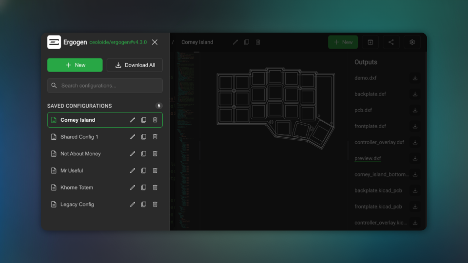

Managing multiple keyboard design variations previously required manually copying and pasting configurations, importing files over and over, or managing multiple browser tabs. There was no native way to save, organize, or quickly switch between different board setups inside the GUI, making iteration on layout alternatives slow and error-prone.

Now you can create, save, rename, duplicate, and switch between multiple configurations directly inside the workspace. A new sidebar navigation lists all your saved configurations with search support, inline renaming, and quick duplication or deletion. You can also export all your designs as a bulk compilation, bundling all your keyboard variants into a single ZIP archive.

**What changed:**

- **Native Multi-Configuration Workspace**: Created a side navigation panel to manage, switch, search, and organize multiple configurations
- **Inline Actions**: Perform inline renaming, deletion, and layout duplication for any saved design
- **Bulk Compilation Export**: Added an "Export All" option that compiles and packages all saved configurations in a single ZIP folder structure
- **Preview Mode**: Enabled temporary shared URL preview loading alongside your permanent saved layouts
- **Data Migration**: Automatically migrates legacy configuration storage formats into the new system without data loss

## Custom Templates Support in GUI

July 05, 2026

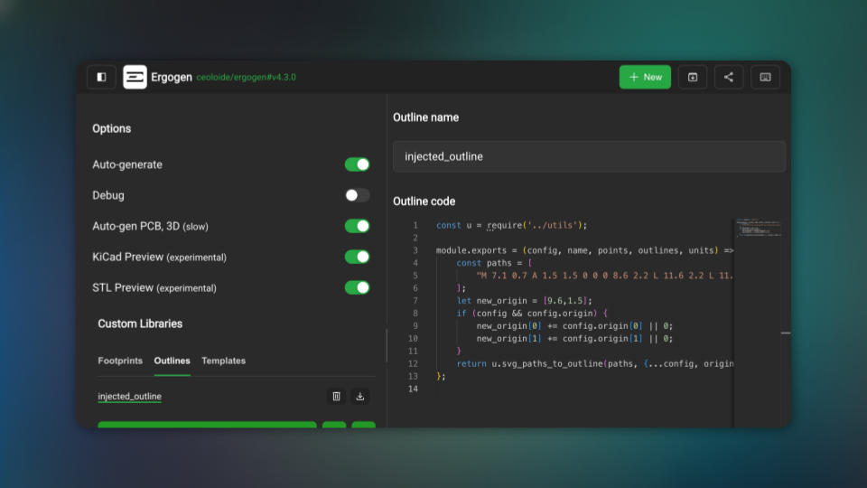

Creating and editing custom outlines or templates previously required running the tool offline. You had no way to create, view, or manage your custom Ergogen outlines or templates inside the web interface.

Now you can manage custom templates directly from the settings panel, complete with template name editing, code editing, and conflict resolution. You can add, load from local files or folders, and fetch directly from a `templates/` or `outlines` directory in your GitHub repositories. When exporting, your custom templates are also saved in the generated ZIP.

**What changed:**

- **GUI for custom templates**: Created a new tab in custom libraries to add, edit, and delete templates in your design
- **GitHub & local ZIP template extraction**: Automatically extract templates from `templates/` folder when loading from GitHub or local archives
- **Clean template exports**: Save footprints, outlines, and templates to their respective directories when downloading the configuration ZIP
- **Default boilerplate structures**: Added helper boilerplates for newly created custom templates and custom outlines

## Share A Link To Your Keyboard Configuration

November 3, 2025

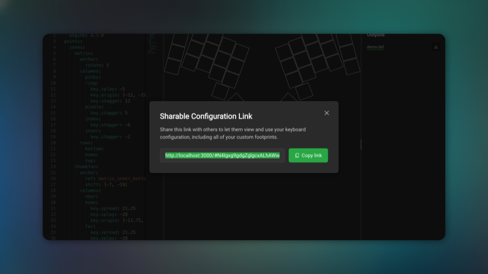

Sharing your keyboard design with others used to be a hassle. You'd have to export your configuration file, package up all your custom footprints separately, and send multiple files or links. The recipient would then need to load everything manually, making collaboration tedious and error-prone.

Now you can share your entire keyboard configuration – including all custom footprints – with a single link. Click the share button and a dialog appears with your personalized shareable URL. The link is automatically copied to your clipboard, ready to paste anywhere. Recipients can simply click the link to load your complete configuration with all custom components intact.

**What changed:**

- **Shareable links**: Generate a single URL that contains your keyboard configuration
- **Complete configuration sharing**: All custom footprints and templates are included in the shared link

## Load Configurations from Local Files

November 2, 2025

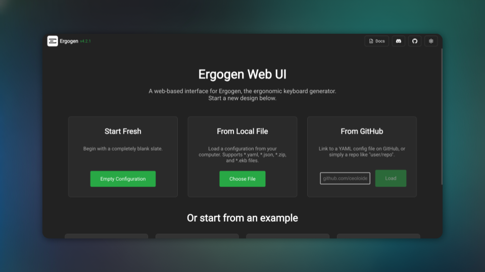

Working with keyboard configurations used to mean you could only start from scratch or load from GitHub. If you had a configuration file saved on your computer, you'd need to copy and paste it manually – and forget about loading custom footprints that way!

Now you can load entire keyboard configurations directly from your computer. Simply click the "Choose File" button or drag and drop any supported file onto the page. The app accepts YAML and JSON configuration files, as well as ZIP and EKB archives that include both the configuration and custom footprints.

When loading archives, the app automatically extracts custom footprints from the `footprints` folder, just like when loading from GitHub. If you already have footprints with the same names, you'll see the same friendly conflict resolution dialog to choose how to handle duplicates.

**What changed:**

- **Local file loading**: Load configurations directly from your computer using YAML, JSON, ZIP, or EKB files
- **Drag and drop support**: Drop files anywhere on the welcome page for quick loading
- **Archive support**: ZIP and EKB archives automatically extract configurations and footprints
- **Conflict resolution**: Same interactive dialog for handling duplicate footprints as GitHub loading

## Load Keyboards Directly from GitHub

October 13, 2025

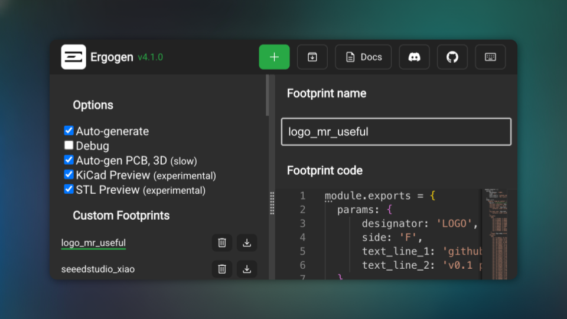

Ever wanted to share your keyboard design with a friend or try out someone else's layout? You can now load complete keyboard configurations directly from GitHub, including all the custom footprints!

Previously, loading a configuration from GitHub only brought in the basic layout file. You'd have to manually recreate any custom components (like special switches or connectors) that the design depended on. This was time-consuming and error-prone, often leading to confusing errors about missing parts.

Now, when you load a keyboard from GitHub, the app automatically discovers and loads all custom footprints from the repository – even those stored in separate libraries using Git submodules. If you already have a footprint with the same name, you'll get a friendly dialog asking whether to skip, overwrite, or keep both versions.

The app also got smarter about finding configurations. It can now search through entire repositories to locate the right files, and it'll warn you if you're running low on your hourly request allowance so you know to take a break before trying again.

**What changed:**

- **Automatic footprint loading**: Custom components are now loaded alongside configurations from GitHub repositories
- **Smart conflict resolution**: Interactive dialog lets you choose how to handle duplicate footprint names
- **Git submodule support**: Loads footprints from external libraries referenced in the repository
- **Intelligent file discovery**: Searches entire repositories to find configuration files in any location
- **Usage monitoring**: Proactive warnings when approaching GitHub's request limits, with clear guidance
- **Better feedback**: Loading progress bar now appears when fetching from GitHub
