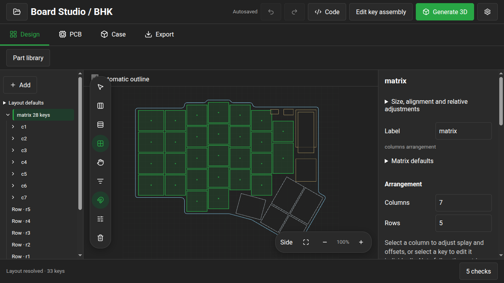
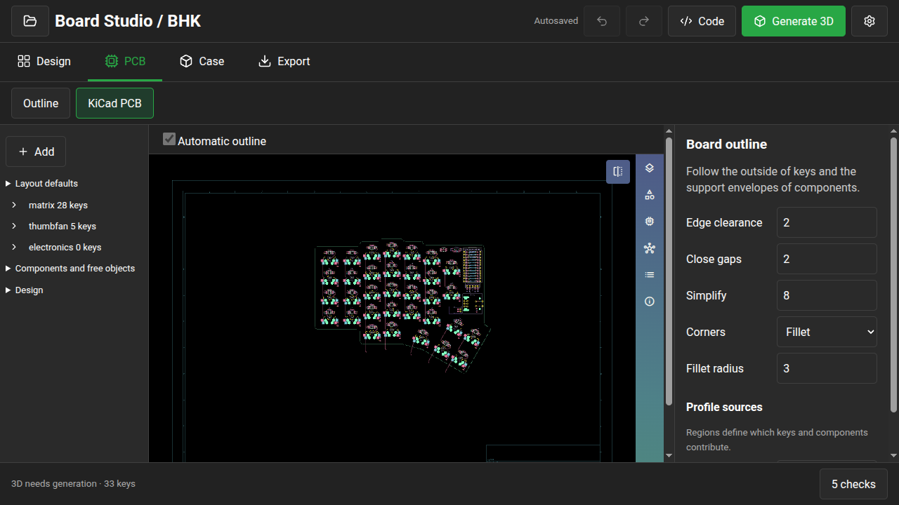

# BHK Board Studio migration

Validated locally on September 12, 2026 in `branch-consolidation/ergogen-gui`.
Portable source: `../bhk/boardstudio.yaml`, byte-identical to the gallery YAML.

## Design parity

- 33 keys: 28 matrix cells and five thumbfan cells.
- All original object positions preserved within 0.000001 mm; maximum observed
  difference 0.0000000633302 mm. Rotations and electrical properties preserved.
- Physical cells remain separate from electrical row/column assignments.
- Generated PCB has the same 2,632 records excluding its revision title block.
  Footprints, pads, copper and nets match after numeric normalization to five
  decimals and record-order normalization. The 36 outline primitives differ
  by at most 0.000671 mm after parametric trigonometry replaces rounded thumb
  coordinates. This is not byte-identical PCB output across the migration.
- Original legacy YAML and editable KiCad files were not modified.

## Validation

- `NODE_OPTIONS=--no-experimental-webstorage pnpm test:unit src`:
  114 files, 757 tests passed.
- Typecheck, ESLint, Knip and changed GUI Markdown passed.
- `NODE_OPTIONS=--no-experimental-webstorage pnpm exec vite build` passed.
- `e2e/bhk-matrix.spec.ts`: desktop 1440×900 and mobile 390×844 passed,
  including row selection, relative movement, adding a missing cell, peer net
  inheritance, undo, column stagger expressions and horizontal overflow.
- `e2e/bhk.spec.ts`: PCB/outline downloads, pad containment, KiCanvas rendering
  and byte-identical offline regeneration passed.
- Browser tests used an isolated agent workspace through its loopback CDP
  endpoint. KiCanvas required SwiftShader in that Xvfb workspace.

## Existing workspace gate failures

- Standard `pnpm run precommit` stops in Markdown lint on vendored footprint
  documentation. Its incidental vendor formatting was restored.
- Unscoped `pnpm test:unit` also collects three vendored Node test suites in
  jsdom; those fail outside the GUI test environment. All GUI tests pass.
- Standard `pnpm run build` staging cannot find
  `vendor/boardstudio-footprints/vendor/kicad/LICENSE`. The adjacent working
  footprint library also fails its manifest hash check for
  `battery_connector_jst_ph_2.js`. These library states were not changed.

New cells retain the authored switch/diode circuit and receive isolated LED
ports; connecting those ports and adapting authored routing after pitch edits
remain design work. This migration does not establish enclosure fit or
fabrication readiness. Changes remain local and uncommitted.
