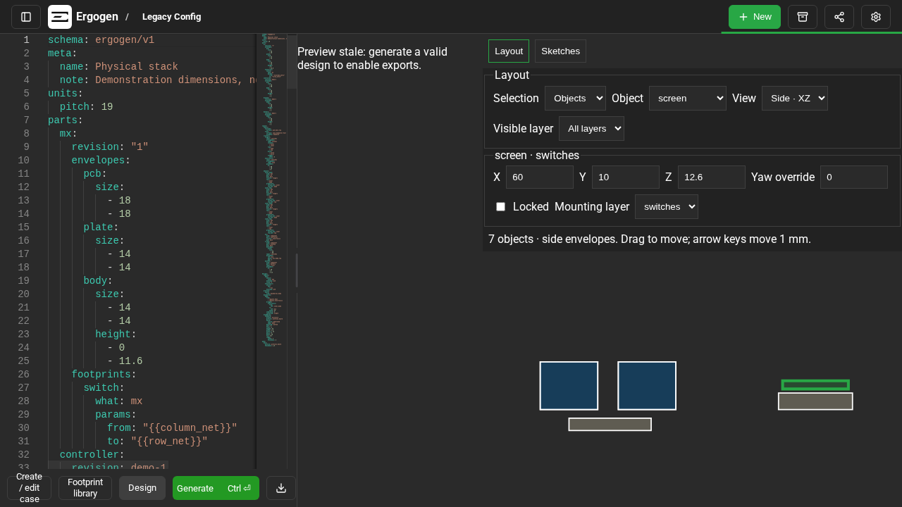

# Native configuration validation

Validated in the two `enclosure-work` checkouts on 2026-09-09.
The [architecture reference](../../ergogen/docs/architecture.md) owns the contract;
this file records verification of its implementation.

| Check | Result |
| --- | --- |
| Engine: `npm test` | 269 passing; final hardware-relief guard also passes 11 focused checks |
| GUI: `NODE_OPTIONS=--no-experimental-webstorage pnpm run precommit` | 509 tests passing; formatting, lint, types, and dependency checks pass |
| Packaging: `pnpm run test:release` | 9 passing |
| Browser: focused gasket-plan and enclosure specs | 8 passing; includes BHK CNC generation, desktop/phone editing, touch gestures and offline generation |
| Engine and GUI production builds | Pass |
| Installed engine source and architecture | Byte-identical to the enclosure checkout |

The Node option avoids the host's experimental Web Storage conflicting with
jsdom. Browser tests use fresh headless Chromium contexts and a dedicated preview
server, with no connection to the user's browser.

## Acceptance evidence

- Native documents reject unsupported schemas and properties with source locations.
  Legacy saved source remains readable and can be downloaded without conversion.
- Reference anchors never enlarge a board or become switch openings. Regions
  select typed envelopes; cluster gaps require explicit bridges.
- Layout edits retain formulas, shared aliases, arrangements, and comments.
  Dragging is one undo operation. Locks prevent numeric and direct movement.
- The physical-stack example places the display above its controller and the
  battery on the enclosure floor. PCB thickness, body heights, and floor changes
  update the appropriate dependants. Movement and body/PCB conflicts are reported.
- A tilted-stack CAD test compares exported MCU, display, and battery body bounds
  with the layout report to 0.01 mm. Shell and plate STL exports are nonempty.
- BHK retains all original point positions, 145 emitted footprints, and 1,122 pad
  definitions/net assignments after normalizing KiCad 10 stroke syntax. Its
  perimeter intentionally uses the new automatic boundary.
- KiCad 10.0.6 loads the native BHK PCB and exports Edge.Cuts. This is a load/export
  check, not a DRC or fabrication approval.
- Browser coverage includes layout/side/assembly views, sketches, case manufacture
  settings, ZIP export, offline regeneration, native footprint links, native model
  bindings, and imported PCB model associations.

## BHK outline repair

Regression checks now reject accidental interior perimeter holes and preserve
all 145 footprint placements and pad/net definitions. The original keycap tags
establish tall 1.5u keys: 18 × 27 mm, with unchanged 14 × 14 switch openings.
The example follows exposed key edges with local gap closing and aligned bridges. Shared part bindings remove
repeated hardware definitions while preserving per-instance references.

The current repair passes 255 engine tests, 500 GUI unit tests, 8 packaging checks and
6 browser checks, including offline BHK regeneration. Production build and
TypeScript checks pass. KiCad can load and export the repaired Edge.Cuts; this
is not a DRC or physical-fit approval.

## Aligned transitions and control support

BHK uses tight key regions with local gap closing, a rectangular electronics region, and aligned top,
bottom and right webs. Power and reset switches are independent components with
PCB support from their existing footprint pads and bosses. Their placements and
all original pad/net definitions remain unchanged.

The old native BHK config produces off-board-pad findings for PWR1 and RST1.
The updated config produces none. The browser test independently reads the
downloaded PCB and checks every pad area, including the JST connector's custom
polygons, against Edge.Cuts. This check covers pad containment, not full DRC.
The region wrapping options are `tight` (default), `hull` and `box`. BHK uses
`close: 2` and a 26 mm inward bottom bridge. Its regression test samples the
exposed lower thumb edges at both -15 and -30 degrees, catching hull shortcuts
while retaining the single-contour, no-hole and all-pad containment checks.

## Perimeter finishing

BHK uses `simplify: 8` and `corners: {fillet: 3}`. The red-marked thumb jogs become
intersections of the retained edge directions. Teal-marked inside corners receive
3 mm fillets, including shallow stagger steps that blend into adjacent arcs.
Choose `corners: {chamfer: 3}` for straight inside and outside chamfers.
Outside bevels preserve the full clearance envelope. The exported BHK Edge.Cuts
regression requires only lines, no arcs, and checks every pad area.
The generator rejects relief that cannot meet adjacent edges tangentially.

Regression tests check safe simplification, retained outside arcs, both inside
styles, winding, units, invalid sizes, and explicit cutouts. BHK retains a single
closed outer contour, no internal slivers, and all original pad/net definitions.
The fillet contour decreases from 58 to 36 analytic segments; chamfer mode uses
37 straight segments without fillets. Each of the four shallow top steps
exports one 45-degree diagonal, with no intermediate facets. Rotation and
reversed winding have matching geometry. Both styles have been
rendered and checked for pad containment; this is not a cutter/toolpath check.

## Limits

BHK now uses the published 2.9 mm nice!view module thickness and a separate
7 mm support layer for its supplied sockets. Installed sockets still need
confirmation; controller, scrollwheel and battery envelopes remain unresolved.
See [dimension sources](../../ergogen/docs/component-dimensions.md). PCB-only
bindings without body envelopes also remain unresolved for clearance. The BHK
model-upload test uses a synthetic stand-in, not a measured controller model.

Envelope collision checks can be conservative for curved or polygon bodies.
Physical fit, suspension feel, CAM, slicing, and fabrication remain unverified.
Case height is never silently increased to hide a conflict.

The Layout workspace edits existing objects and clusters. Full visual creation of
every board feature remains outside this implementation's editor scope.

Build output retains upstream CAD/geometry dependency warnings about bundle size,
externalized Node modules, and dynamic evaluation. The generated engine bundle also
contains upstream trailing whitespace; authored files pass `git diff --check`.

## Review regressions

Cache tests retain native case-height and PCB-pad blockers exactly once across
mount-count edits, reuse geometry, and invalidate on outline or asset changes.
Standalone and mixed-assembly PCB exports remain byte-identical on cache hits.
Imported enclosures include native batteries in the declared mounting frame and
subtract service openings from the shell; imported PCB bytes remain unchanged.
Alias movement preserves existing offsets, formulas, siblings, comments and locks.

Browser checks confirm cached height blockers remain visible and exports remain
blocked after a mounting edit. Imported projects render the battery, export its
STL, and retain the service opening in the shell. A separate solid-volume check
verifies material was removed by the opening. These are software geometry checks,
not physical-fit or fabrication approval.

## Native gasket cleanup

BHK now removes nine obsolete gasket anchors and six Corne screw-hole objects.
The original baseline files remain immutable; parity checks exclude only those
intentional removals. Automatic flat gaskets avoid curved and short corner spans.
Regression tests cover mounting-mode cleanup and undo, inline YAML batch edits,
contact grab offsets and final release coordinates, and dismissing touch hints.

A rotated-body regression rejects rectangular bounds in place of the actual
in-plane contour. BHK now receives angled thumb-edge contacts. Browser checks
cover desktop and phone layouts, dragging, insertion/deletion, undo, wheel/pinch
zoom and pan without geometry changes or covering the selected contact.

## CNC relief verification

BHK generates all three CNC parts without radius blockers. Browser generation
confirms zero blockers and applied corner relief; five existing component-envelope
checks remain incomplete. Engine regressions cover rotated arcs, mixed processes,
gasket pockets, plate webs, mounting contacts and material around nut pockets.
The generated plate profile and exported solids use the prepared geometry.
