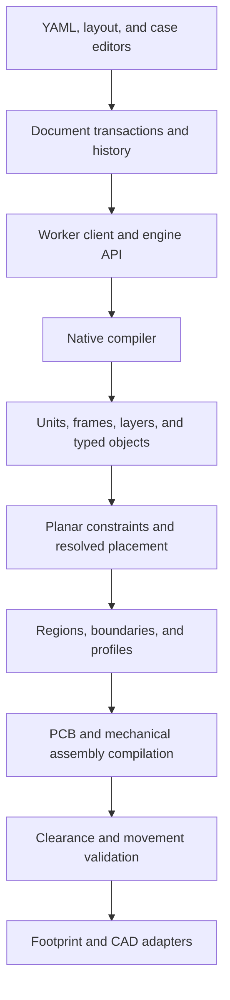

# Native keyboard architecture

This is the architecture reference for the native configuration implementation.
Update this document in the same change as any contract, ownership, or dependency
change. Examples and tests are the executable specification. Package versions do
not select configuration semantics: native documents declare `schema: ergogen/v1`.

Component dimensions and mounting assumptions for BHK are recorded in
[component-dimensions.md](component-dimensions.md). Keep module thickness separate
from socket standoff and retain sources when revising either.

## Ownership



The engine owns physical classification and geometry. UI services own document
transactions and worker requests. Renderers display resolved results; they never
infer object kinds from tags, names, visibility, or footprint filenames.

The engine accepts native YAML, JSON, or objects. It does not call the historical
configuration preprocessor. Existing footprint emitters and geometry operations
remain implementation adapters, not alternate configuration languages. Imported
KiCad boards use the inventory adapter; native boards carry their inventory
forward without reparsing their own exported PCB.

## Document and resolved model

The public sections are `meta`, `units`, `parts`, `layout`, `designs`, and `pcbs`.
The contract is `src/native/ergogen-v1.schema.json`, generated from `schema.js`.
`build:schema` produces the standalone validator used in Node and browser builds.
Validation does not coerce, default, or remove authored values. YAML parser ranges
attach diagnostics to source lines; duplicate keys and unsupported schemas fail.

`layout.objects` contains named `key`, `component`, `mount`, and `anchor` objects.
`layout.clusters` declares free, column, or arc arrangements. `layout.layers`
declares physical mounting frames. IDs are references; labels are presentation.
PCB references are explicit or deterministic from object/binding IDs. Adding or
reordering an object must preserve existing footprint references and net names.
Numeric net codes are an export detail; net names carry electrical identity.

Column arrangements use stable column and row IDs. A column frame applies pitch,
stagger and `offsets.<column>: [x, y, z]`, then splay about its first row. Each
row is placed inside that rotated frame; individual key overrides remain local.
Changing column splay therefore moves and rotates the entire column.

Keys receive automatic `column_net` and `row_net` properties unless explicitly
overridden. Matrix defaults are `<cluster>_<column>` and `<cluster>_<row>`.
Arc and free-cluster keys share `<cluster>_row` and have `<key>_column`; unclustered keys use
`<key>_column` and `<key>_row`. Reordering IDs keeps these names stable.
The GUI creates a matrix from numeric dimensions, edits columns as groups,
and preserves removed cells until the user restores them. These commands
retain the arrangement in YAML instead of replacing it with absolute points.

`process()` returns `layout` alongside outlines, boards, and assemblies. The
layout report contains objects, clusters, layers, world transforms, envelopes,
source paths, and findings. Compiled defaults never overwrite authored YAML.

A part has a revision and optional footprint bindings, model bindings, named
attachments, and envelopes. Instances override individual declarations. Envelope
names describe purpose: `pcb` for board support, `body` for physical clearance,
`plate` for openings, `keycap` for the top-view key shape, and `service` for case openings.
Top-view key previews prefer `keycap`; side views retain the physical body. Other named envelopes can
be selected explicitly. Unknown dimensions remain unresolved; they are not key
rectangles. An anchor cannot own an envelope or emit a footprint.

Part footprint bindings are shared by name. An instance can provide only its
reference (`footprints: {switch: S1}`), or a mapping overriding `reference`,
`params`, or `placement`. Parameter and placement fields merge one level;
arrays replace. A new binding must supply `what`. No emitted reference changes
when moving a binding into a part. BHK uses two parts for its normal and rotated
LED arrangements, keeping their distinct footprint identities.

## Frames and physical stacking

Dimensions use millimetres and angles use degrees. The assembly convention is
right-handed, with positive Y upward and positive Z upward. Rotations in the
layout plane are counterclockwise. Matrix storage is row-major; vectors are
column vectors. A placement composes its parent frame with local translation,
Z rotation, then X tilt. Local overrides add translation and Z rotation without
replacing formulas or arrangement parameters.

Layer surfaces include `pcb.<id>.top`, `pcb.<id>.bottom`, `case.<assembly>.floor`,
`case.<assembly>.lid`, `plate.<assembly>.top`, and `plate.<assembly>.bottom`.
Layers are mounting frames, not automatically manufactured slabs. PCB, plate,
foam, spacer, and case material comes from actual parts or assembly features.
Electrical PCB membership is independent of physical layer membership.

A native PCB instance has one owning assembly. Declare separate PCB instances
for separate physical boards; two cases cannot drive the same board's height.

Object references use IDs, named attachments, or `<id>.<envelope>.top|bottom`.
`placement.above` and `placement.below` align body surfaces with a nonnegative
`gap`. One vertical relationship drives a position. Stacking surfaces must be
parallel; select a suitable mounting layer for a different orientation. Cyclic
placement and unit references fail before geometry compilation.

Nominal placement dependencies and physical mounting ownership are separate.
A PCB-mounted display follows PCB motion. A case-mounted battery follows the
case, even if a PCB object was used to choose its nominal XY position. Both can
share an XY projection without a collision when their vertical envelopes clear.
Body dimensions and offsets are relative to their own mounting frame.

The compiler retains 3D transforms even though the first editor exposes planar
movement, height, and in-plane rotation. Surface orientation supplies tilt.

## Layout constraints

Native constraints run after nominal frames and before points, outlines, PCB
footprints or case inventory. `layout.constraints` is a named mapping. Rule IDs
are stable diagnostic paths, including on cached analysis. Placement formulas
supply the seed; only coordinates listed in `placement.solve` may move. Locks
remove all solver freedoms. An arranged cluster moves as one frame, retaining
its pitch, stagger, splay, arc parameters and object identities.

```yaml
units: {pitch: 19}
layout:
  objects:
    a: {kind: key, part: mx}
    b:
      kind: key
      part: mx
      placement: {at: [18, 1, 0], solve: [x, y]}
  constraints:
    row: {type: horizontal, refs: [a, b]}
    pitch: {type: distance, refs: [a, b], axis: x, value: pitch}
```

| Rule | References | Dimension |
| --- | --- | --- |
| `coincident` | Two origins or attachments | None |
| `horizontal`, `vertical` | Two or more origins | None |
| `distance` | Two origins | `value`, optional signed `axis: x/y` |
| `angle` | Two oriented frames | Relative `value` in degrees |
| `equal_spacing` | Ordered list of at least three origins | Equal vector spacing |
| `symmetric` | Two origins and an axis frame | `axis: x/y`, default x |

References accept object IDs, `objects.<id>`, `clusters.<id>`, named attachments,
and `.origin`. `solve` accepts `x`, `y`, and `rotate`; omitted coordinates stay
driven by placement. Distance without an axis is nonnegative Euclidean distance.
Axis distances are signed from the first reference to the second. Equal spacing
keeps all referenced points collinear in their supplied order.

`native/constraints.js` adapts frame origins and directed axes to PlaneGCS.
Rigid child relations, mirror relations, and locked frames are graph constraints.
The adapter extracts only additive local offsets, re-resolves the scene and
vertical stacking, then checks rule residuals. It never overwrites input values.
The layout report exposes solved dimensions, remaining degrees of freedom and
redundant rule IDs. Conflicting rules return source-path diagnostics and no new
geometry. Underconstrained layouts remain usable and report their free movement.

This solver is planar. Frames must have parallel mounting planes. Physical
layers, `above`, `below`, and `gap` continue to own vertical relationships;
these are not arbitrary 3D geometric constraints. The
[constrained example](examples/native/constrained.yaml) is an executable reference.

## Geometry and validation

Regions select typed objects by kind, cluster, IDs, PCB, or layer and name the
envelope they consume. A PCB region uses one board plane. Gap closing occurs
within each selected cluster; explicit bridges connect groups. Reference anchors
remain addressable without contributing material.

Key-derived boundaries follow exposed envelope edges, preserving each key's
angle and stagger. Use the default `wrap: tight` with local `close` to join
inter-key gaps. BHK uses `close: 2` within each key cluster and a 2 mm boundary
clearance; its thumb perimeter follows both the -15 and -30 degree key edges.
Named bridges join clusters and provide inward material without replacing the
exposed perimeter with a diagonal shortcut. BHK's bottom web is 26 mm wide to
fill the enclosed gap beside the thumb cluster.

Perimeter finishing can extend neighboring straight edges to their intersection
instead of retaining every small jog. It must preserve their directions and all
required key/component support, even when it shortens the individual edge runs.

`wrap: hull` is an explicit alternative for polygonal support envelopes. It
can cut across concavities and should not be chosen automatically for keys.
It operates within each cluster, never across separate clusters. `wrap: box`
uses each cluster's rectangular bounds in the PCB plane, suitable for an
orthogonal electronics bay. Hull mode
requires polygonal support; a circular body can declare rectangular PCB support.
Bridges use `ends: flat` for rectangular webs that stop at attachment points;
`ends: round` (the default) retains rounded slots. BHK uses aligned rectangular
webs to avoid circular lobes around electronics.

Bridges can instead use `align: top | bottom | left | right` with two
`{feature: regions.name}` anchors. They form rectangular webs at the shared edge
of those features: the lower top, higher bottom, rightmost left, or leftmost
right. `width` controls inward web thickness. Attachments include the facing
boundary extent so a short sloped tail cannot survive beside the web. Alignment
requires intersecting edge spans; invalid attachments produce a diagnostic.
Do not combine `align` with shifted anchors or `ends`.

```yaml
bridges:
  top:
    from: {feature: regions.matrix}
    to: {feature: regions.electronics}
    align: top
    width: 20
```

Boundary and profile finishing is optional:

```yaml
clearance: 2
simplify: 8
corners: {fillet: 3} # Or: {chamfer: 3}
```

`simplify` is a millimetre limit on both the connector run removed and movement
of its attachment points. Retained straight edges must be longer than the limit.
The simplifier intersects those edges, merges collinear runs, and keeps existing
tangent corner arcs. A candidate is accepted only if closed, nonintersecting,
and containing the original material. It does not make a global hull.

`corners` chooses the corner treatment. `fillet` specifies the radius in
millimetres. `chamfer` builds the same-radius relief, then replaces its concave
arcs with straight chords between their tangent points; at 90 degrees its value
also equals the edge setback. Fillet mode retains existing outside corner arcs.
Chamfer mode replaces outside arcs too, using tangent bevels that enclose the
rounded support instead of cutting into its required clearance. Its perimeter
contains straight segments only; explicitly authored circular cutouts retain
their own geometry. Adjacent bevel facets at a shallow step between parallel
edges collapse into one 45-degree supporting line. The transition is bounded
by the combined diagonal length of two corner reliefs (2 sqrt(2) times the
chamfer size); required clearance must remain contained. This prevents small
facets where neighboring inside and outside reliefs meet. Short
stagger steps can blend into adjacent curves. Unusable dimensions and changes
that join contours or close holes produce diagnostics; sizes are not silently
clamped. Choose the radius for the intended tooling. This is outline geometry,
not a CAM or fabrication approval.

Finishing runs after clearance and legacy `round`, before authored modifications
and explicit cutouts. Protected gaps and occupied-area checks remain enforced.
Explicit cutouts retain their own geometry. The native schema exposes the settings
for YAML tooling and a future visual boundary editor; omission preserves the
unfinished geometry. BHK uses 8 mm simplification and 3 mm inside fillets.

Physical controls are independent component objects, even when their electrical
placement references a key. BHK's power switch and reset button own PCB support
envelopes and are selected automatically by the electronics region. A footprint
binding attached to a key does not silently inherit mechanical key dimensions.
After emission, native PCB checks compare full rectangular, round-rectangular,
circular, oval and filled custom-polygon pad areas against Edge.Cuts. Outside areas identify the
footprint reference and source binding. Other custom pad geometry retains an explicit
unverified warning. These checks report errors; they never resize the PCB behind
the author's boundary definition.

Boundaries retain analytic modifications, sketches, bridges, and cutouts.
Protected gaps reject smoothing or offsets that enter their reserved geometry.
Occupied support envelopes must remain contained. Board and enclosure profiles
share the same resolved boundaries.

Early clearance checks use oriented envelopes and declared movement ranges.
Curved/polygon envelopes may produce conservative warnings. Solid generation
checks actual modeled shell intersections. Missing physical measurements remain
visible findings; successful software generation is not physical-fit evidence.
Case height is authored: a fit conflict never silently resizes the enclosure.

Imported PCB assemblies retain their board components, models, and cutouts, then
append applicable native bodies and service openings. Independent mounting
layers therefore reach clearance analysis and solid generation for imported and
generated boards alike. Adding a case object does not rewrite imported copper.

## Source editing and lifecycle

Document transactions patch local source ranges. Moving a generated member
changes its override, not sibling positions or arrangement formulas. One drag is
one undo operation. Shared aliases are not modified when an instance is edited.
Movement materializes the selected alias before reading its existing override,
so inherited offsets and formulas survive the first edit.
Locks affect editing; visibility and exploded offsets affect presentation only.

Worker requests carry source, library, injection, and asset revisions. Only a
matching result is current. Lightweight analysis runs during editing; full CAD
is explicit. Stale results cannot be exported as current output.

The analysis cache retains an internal board bundle: generated PCB inventories,
assembly board sources, and PCB findings. PCB outputs come from this result,
including boards without assemblies, rather than callback side effects. Cache
hits reuse contours and PCB compilation while recalculating mounting findings
and combining current layout findings with cached PCB findings exactly once.
Each response receives separate diagnostic arrays. Layout, dimension, and asset
changes invalidate the cache; mounting-only edits retain clearance blockers.

## Packaging and verification

The GUI consumes a pinned package built from the enclosure engine checkout.
Schemas, declarations, source modules, and the GUI bundle must identify the same
engine revision. The old gallery is archived outside the runnable example list;
legacy saved documents remain readable and exportable without conversion.

The BHK baseline in `test/fixtures/native-baseline` preserves original source,
resolved points, and PCB output. Native acceptance compares placement and
footprint/net behavior separately from the intentional automatic perimeter
change. Original controller/display heights are unresolved and must not be
presented as measured values.

Run native compiler tests, retained geometry tests, GUI tests/type checks,
production packaging, and browser tests against the packaged engine. Inspect
layout, side, and assembly views. Record physical-fit uncertainties separately.

## Decisions

- **2026-09-09:** Use one native schema; do not ship a legacy configuration importer.
- **2026-09-09:** Separate typed placement objects from manufacturing envelopes.
- **2026-09-09:** Make mounting layers and vertical relationships first-class.
- **2026-09-09:** Use manual battery placement and explicit case height with checks.
- **2026-09-09:** Replace BHK's perimeter with an automatic boundary while retaining
  placement and electrical assignments.

## Authoring a physical stack

```yaml
layout:
  layers:
    electronics: {surface: pcb.main.top}
    floor: {surface: case.keyboard.floor, assembly: keyboard}
  objects:
    mcu:
      kind: component
      part: controller
      layer: electronics
    screen:
      kind: component
      part: display
      layer: electronics
      placement: {ref: mcu, above: mcu.body.top, gap: 1}
    battery:
      kind: component
      part: battery
      layer: floor
      placement: {ref: mcu, at: [30, 0, 0.5]}
```

Parts supply the measured `body.size` and `body.height: [bottom, top]`.
The complete runnable example is `docs/examples/native/physical-stack.yaml`.
Its dimensions demonstrate the relationships; they are not a parts catalogue.

An explicit mounting layer owns height and tilt. A reference on another layer
supplies planar position and yaw; it does not move the battery up onto the PCB.
An explicit `above` or `below` relationship supplies the vertical dependency.
Surface frames retain positive Z upward: to place a body below a PCB, use its
bottom mounting layer with `below: pcb.main.bottom` and a declared gap.

The floor datum follows the enclosure's interior floor. A typing angle tilts that
interior; the exterior bottom is trimmed flat by the enclosure builder. Layout
bounds and CAD reference bodies share the resulting assembly transform.

## Editor scope and test ownership

The Layout workspace edits existing objects and clusters. It supports top and side
views, a layer filter, numeric position, yaw overrides, dragging, keyboard movement,
and locks. Layout resolution remains available when a board boundary is invalid.
The case designer provides explicit solid generation, the assembled/exploded 3D
view, measured component envelopes, openings, and hardware controls. Hardware
features remain named assembly features; a layout `mount` can anchor those features
without becoming a key or automatic PCB support.

Mirrored members have stable generated IDs and store edits under the mirror
cluster's `overrides` mapping. Part and cluster definitions remain shared; editing
an instance does not rewrite an alias definition or an arrangement formula.

`test/unit/native*.js` exercises the public native API, physical relationships,
CLI, BHK parity, and exported solid bounds. `test/helpers/adapter-engine.js` is a
historical harness for existing backend fixtures. It is excluded from published
packages and is not a supported legacy entry point. Historical CLI snapshots are
archival; `native_cli.js` verifies the current command-line contract.

The GUI pins a content-addressed engine tarball under `vendor/`. Rebuild and repin
it after engine changes, then regenerate the browser bundle and previews. Do not
validate a newer source checkout against an older installed package.

## Mounting interaction

Selecting gasket mounting removes rigid ledges and plate/PCB posts in one draft
transaction; case-closing screws remain. Automatic flat contacts use straight
spans with corner clearance. In-plane body contours preserve their rotation for
clearance checks; tilted bodies retain conservative bounds. Manual contacts
remain pinned during redistribution.
The 2D editor separates geometry coordinates from pan/zoom and preserves the
initial grab offset through pointer release. Selection controls sit below the
canvas; touch and drag dismiss contextual hints.

The native BHK example omits the former gasket anchors and six Corne screw holes.
Native enclosure contacts and case-closing hardware replace those layout helpers.
Electrical component placements and wiring remain unchanged.

## CNC pocket preparation

Manufacturing settings participate in geometry generation. `enclosures.js`
registers each pocket's part, source feature and depth interval. `tooling.js`
adds local cutter-sized relief without shrinking a required opening;
`pocket-plan.js` validates the proposed removal before the solid compiler applies
it. FDM parts keep their nominal profiles even in mixed-process assemblies.

The registry covers cavities below the roof, cover openings, plate cutouts,
gasket pockets, ledges, plate clearance, registration recesses and hardware
pockets. The compiler cuts only the additional removal, preserving existing
posts and shelves. It publishes the relieved plate profile and reports measured
pocket radii from the same prepared geometry. Signed line/arc area determines
winding, including relief arcs larger than a semicircle. Endpoint comparisons
and tangent checks use the geometry export tolerance.

Relief cannot breach the declared minimum wall, thin neighboring plate webs or
cut a mounting post. Rejected relief leaves the nominal pocket and reports a
feature-specific blocker. Circular bores retain their specified fit. Side
access, reach, drilling and setup checks remain separate; this is not CAM or
physical-fit certification. Source outlines and electrical placements are not
rewritten by manufacturing preparation.

Plate pockets come from the completed nominal plate, including profile cutouts
and mounting holes. Boolean geometry merges overlapping openings before pocket
registration. Outer plate contours bound perimeter relief; individual voids
remain separate for web checks. Circular holes keep their nominal diameter.
Post collision checks require overlapping Z intervals beyond the geometry
tolerance before testing XY removal; touching faces do not block relief.
Perimeter checks include exact curve bounds before containment sampling so
short relief arcs cannot escape the minimum-wall envelope between samples.

Solid conversion retains analytic arcs. Flat offset remnants below 0.01 mm
length and 0.000001 mm chord error are collapsed, including empty sliver loops.
Contour joins must remain within the existing 0.01 mm export tolerance. Rounded
profiles are validated before conversion; native solid validity is checked after it.


## Layout guides and material sheets

`object.center` prefers a declared attachment, then the keycap or body center.
`columns.<matrix>.<column>` follows splay, including mirrored splay;
`rows.<matrix>.<row>` bisects occupied keycap bounds in the matrix frame.
`object.origin` remains a separate reference. `aligned` constrains its first
reference to an axis of the target frame without changing height or rotation.
Alignment seeds follow target dependencies before the general constraint solve;
cycles and incompatible constraints remain errors without changing source.

`designs.stackups` associates a PCB with plate thickness/gap and named foam,
silicone or gasket sheets. Each sheet names lower/upper surfaces, stock thickness,
optional compression, profile, inset, clearance and extra profile cutouts.
Compression defaults to zero. PCB thickness stays in `pcbs`; assemblies opt into
shared stack dimensions through `stackup`. Existing assemblies without that link
retain their dimensions.

Sheets fit existing gaps without moving structural layers. Material compilation
subtracts intersecting bodies, mounting holes and authored cutouts from shared
profiles. Missing surfaces or contours leave only that sheet unresolved. Ready
layers export `<pcb>_<layer>.dxf` in nominal millimetres; previews reuse those
contours. Section reports expose declared physical heights, and project ZIPs carry
stock/installed thickness, fit status and contour metadata. Reference solids do
not simulate deformation or certify physical fit.
